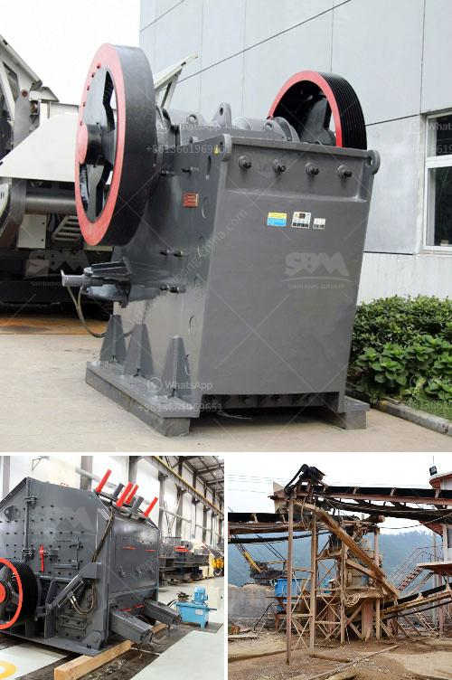

<h3>china raymond roller mills</h3>
Raymond roller mills are widely used in various industries such as mining, construction, and chemical industries. With the rapid development of these industries, the demand for Raymond roller mills also increased rapidly. China, as the world's largest producer of Raymond roller mills, has a rich production base and mature technology, making it an ideal choice for customers worldwide.

Raymond roller mills, sometimes called the vertical roller mill due to its shape, are often used for primary and secondary grinding operations in various materials. They can yield a wide range of powders from limestone, dolomite, diatomaceous earth, silica, clay, and more. The roller mill system is designed to dry, pulverize, classify, and deliver various types of materials with different hardness levels.

One of the key advantages of Raymond roller mills is their high capacity and efficiency. Thanks to the unique design of the grinding roller and grinding ring, these mills can efficiently process materials with Mohs hardness below 9.3 and moisture content below 6%. The transmission device and the analysis engine are critical components that ensure a smooth and reliable operation. Moreover, the vertical structure of the Raymond roller mills enables a compact footprint, saving valuable space in production plants.

China has a long history of manufacturing Raymond roller mills. As early as the 1980s, Shanghai Clirik Machinery Co., Ltd introduced the German advanced technology and developed a new type of Raymond roller mill with domestic and foreign patent certifications. This mill, known as the HGM series Raymond roller mill, has several patented technologies and benefits from the core technology of Clirik.

The HGM series Raymond roller mill adopts a three-dimensional structure, covers a small area, and has a strong complete set. From crushing of raw material to grinding and packing, the system is an independent production system that can work continuously. The finished powder size is uniform and adjustable, allowing customers to produce powder with a narrow particle size distribution. 

In recent years, China's Raymond roller mill industry has achieved remarkable growth due to continuous technological innovation and market demand. The Chinese manufacturers have been striving to improve the performance and reliability of the mills to meet the needs of customers worldwide. The product quality has been greatly improved, allowing China to dominate the global Raymond roller mill market.

In conclusion, China Raymond roller mills have gained considerable popularity in the global market due to their high efficiency, excellent performance, and reliable operation. With decades of experience and technological advancement, Chinese manufacturers continue to produce top-quality mills that meet the diverse needs of various industries. As the demand for Raymond roller mills continues to grow, China is well-positioned to retain its dominance in this industry.
<h3>Contact us</h3><ul><li><strong>Whatsapp:&nbsp;<a href="https://wa.me/8613661969651">+8613661969651</a></strong></li><li><a href="https://swt.shibang-china.com/?git&amp;zhl&amp;china raymond roller mills"><strong>Online Service(chat now)</strong></a></li></ul><h3>Related</h3><ul><li><a href='stone crusher plant philippines.md'>stone crusher plant philippines</a></li><li><a href='iron ore mobile crusher.md'>iron ore mobile crusher</a></li><li><a href='mobile crusher di malaysia.md'>mobile crusher di malaysia</a></li><li><a href='raymond mill in chennai.md'>raymond mill in chennai</a></li><li><a href='feldspar stone crusher.md'>feldspar stone crusher</a></li></ul>