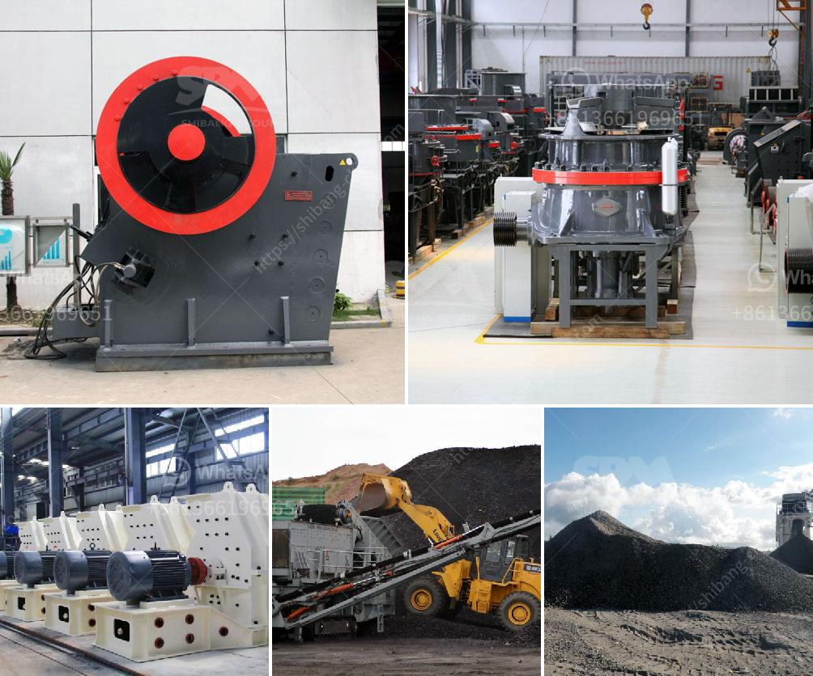

<h3>china roller mill</h3>
In recent years, China has witnessed remarkable growth in various industries. One such sector that has seen significant development is the grinding industry, thanks to the introduction of advanced machinery like the China roller mill. This innovative piece of equipment has revolutionized grinding processes, resulting in improved efficiency and reduced wastage.

The China roller mill is a state-of-the-art machine that utilizes the principle of compression to crush finely powdered materials. It is widely used in industries such as cement, metallurgy, chemicals, and others. The roller mill offers several advantages over traditional grinding methods, making it a preferred choice for many manufacturers.

One of the primary advantages of the China roller mill is its ability to grind materials with high moisture content. Unlike traditional mills that often struggle with moist materials, the roller mill can effectively increase the grinding efficiency, resulting in finer particle sizes. This feature is particularly beneficial in the cement industry, where moisture levels can be high, and a finer grind is required.

Another key advantage of the China roller mill is its high energy efficiency. It operates at lower specific energy consumption compared to other grinding technologies, reducing production costs. This makes the roller mill an economically viable option for industries looking to improve their profitability.

Additionally, the China roller mill offers excellent versatility, allowing manufacturers to grind various materials. From limestone to coal and even hard-to-grind materials like slag, the roller mill handles a wide range of feed materials. Its flexibility and adaptability make it an invaluable asset in an ever-changing industrial landscape.

Moreover, the China roller mill is lauded for its low maintenance requirements. With minimal wear and tear, the machine ensures longer service life and reduced downtime, resulting in improved overall productivity for manufacturers.

In conclusion, the China roller mill has transformed the grinding industry with its impressive capabilities. Its ability to grind high-moisture materials, energy efficiency, versatility, and low maintenance requirements make it a game-changer for manufacturers across various sectors. As China continues to innovate and invest in advanced machinery, the roller mill stands as a testament to the country's commitment to revolutionizing industrial processes.
<h3>Contact us</h3><ul><li><strong>Whatsapp:&nbsp;<a href="https://wa.me/8613661969651">+8613661969651</a></strong></li><li><a href="https://swt.shibang-china.com/?git&amp;zhl&amp;china roller mill"><strong>Online Service(chat now)</strong></a></li></ul><h3>Related</h3><ul><li><a href='quartz stone crusher application.md'>quartz stone crusher application</a></li><li><a href='cement mill manufacturers in italy.md'>cement mill manufacturers in italy</a></li><li><a href='ball mills used in peru.md'>ball mills used in peru</a></li><li><a href='roller mill advantages.md'>roller mill advantages</a></li><li><a href='price list stone crusher machine guangzhou.md'>price list stone crusher machine guangzhou</a></li></ul>