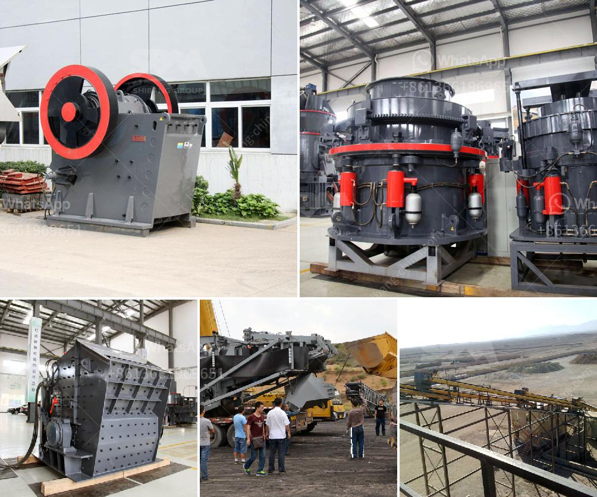

<h3>china talc processing factory</h3>
Talc is a versatile mineral widely used in various industries such as cosmetics, ceramics, papermaking, and more. With a wide range of applications, the demand for talc has been steadily increasing in recent years. China, known for its vast mineral resources, has emerged as a prominent player in the talc processing industry. Among the numerous talc processing factories in China, one leading facility stands out for its innovative approach and commitment to quality – the China Talc Processing Factory.

Located in the heart of China's talc-rich region, the China Talc Processing Factory is a state-of-the-art facility equipped with advanced machinery and cutting-edge technologies. With a strong emphasis on research and development, the factory has consistently strived to surpass industry standards and meet the evolving needs of consumers worldwide.

One of the primary reasons behind the success of the China Talc Processing Factory is its unwavering focus on quality control. The factory follows stringent quality measures at every stage of the production process to ensure superior quality talc products. From sourcing the raw materials to the final packaging, each step is carefully monitored by a team of experts to guarantee the purity, consistency, and safety of the talc produced.

The factory also places significant emphasis on environmental sustainability. Recognizing the importance of responsible mining practices, the China Talc Processing Factory has implemented eco-friendly methods throughout its operations. It adheres to strict regulations and employs state-of-the-art technologies to minimize the environmental impact of its mining and processing activities. Additionally, the factory invests in sustainable energy sources and actively promotes recycling and waste reduction initiatives.

Innovation is at the core of the China Talc Processing Factory's success. The facility continuously invests in research and development to enhance the quality and functionality of its talc products. By collaborating with world-class scientists and experts, the factory explores innovative applications of talc, exploring its potential in emerging sectors like pharmaceuticals, paints, and coatings. This commitment to innovation has not only bolstered the factory's position in the domestic market but has also helped it establish a strong presence in the international arena.

Furthermore, the China Talc Processing Factory prioritizes customer satisfaction. It has developed a robust distribution network to ensure timely delivery of its products to customers worldwide. The factory also offers customized solutions, collaborating closely with clients to understand their unique requirements and provide tailor-made talc products that align with their specific needs.

With its dedication to quality, sustainability, innovation, and customer satisfaction, the China Talc Processing Factory has cemented its position as a leader in the global talc industry. As the demand for talc continues to grow, this facility's commitment to excellence will play a vital role in catering to the evolving needs of various industries. By investing in research, sustainable practices, and customer-centric approaches, the China Talc Processing Factory is shaping the future of the talc industry and contributing to the economic growth of China.
<h3>Contact us</h3><ul><li><strong>Whatsapp:&nbsp;<a href="https://wa.me/8613661969651">+8613661969651</a></strong></li><li><a href="https://swt.shibang-china.com/?git&amp;zhl&amp;china talc processing factory"><strong>Online Service(chat now)</strong></a></li></ul><h3>Related</h3><ul><li><a href='stone crusher price per.md'>stone crusher price per</a></li><li><a href='barite crusher manufacturer guatemala.md'>barite crusher manufacturer guatemala</a></li><li><a href='stone gravel crusher price at ranchi.md'>stone gravel crusher price at ranchi</a></li><li><a href='china multifunction peeling and crushing.md'>china multifunction peeling and crushing</a></li><li><a href='distributor philippines test sieve retsch.md'>distributor philippines test sieve retsch</a></li></ul>