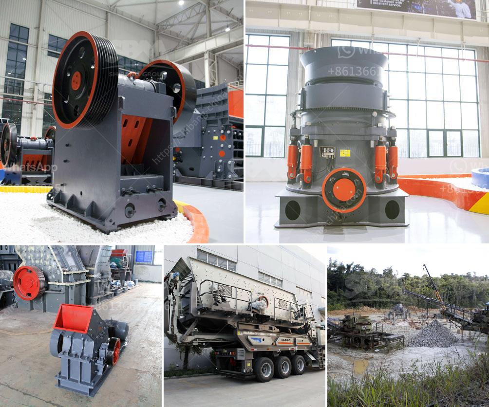

<h3>china top limestone crusher brands</h3>
Limestone, a sedimentary rock, is abundantly available worldwide and has been used for centuries in the construction industry. One of its prominent uses includes providing the foundation for many roadways and buildings. To process this rock efficiently, crushers are needed, and China has some of the top limestone crusher brands in the industry.

When it comes to limestone crushers, there are several renowned manufacturers in China that stand out. Let's delve into the top limestone crusher brands in China.

Fote Heavy Machinery is a well-known heavy-duty equipment manufacturer in China. Its limestone crusher machine is one of the highly sought-after crushers, mainly because of its excellent durability and price performance ratio. Fote machinery has been focusing on research and development, production, and sales of mining equipment for nearly 40 years.

Established in 1980, Henan Hongxing Mining Machinery Co., Ltd. has become a leading name in the mining machinery industry. Their limestone crushers are widely used in the field of cement, mining, and non-metallic mineral processing. Their production quality and design stand out, making them a reliable choice for many customers.

Similar to Hongxing Machinery, SBM has a long-standing history of producing mining machinery since its establishment in 1987. Their limestone crushers are highly efficient and designed for optimal performance. SBM's crushers are known to be featured with advanced technology and excellent durability.

Shanghai Zenith Mining and Construction Machinery Co., Ltd. is another reputable Chinese manufacturer specializing in providing limestone crushers. With nearly 30 years of experience in the field, Shanghai Zenith offers a wide range of limestone crushers that are known for their excellent crushing capacity and efficiency.

Another prominent manufacturer, Henan Liming Heavy Industry Science & Technology Co., Ltd., specializes in the research, development, and production of crushing and grinding equipment. Their limestone crushers are designed to provide customers with the maximum output and high-quality end products.

China has made a significant impact on the crushing equipment industry, and several top limestone crusher brands have emerged. Fote Heavy Machinery, Hongxing Machinery, SBM, Shanghai Zenith Mining and Construction Machinery, and Henan Liming Heavy Industry Science & Technology are among the top manufacturers in this category. These brands have proven their excellence in terms of product design, durability, and overall performance. Customers looking for reliable and efficient limestone crushers can trust these brands to meet their needs.
<h3>Contact us</h3><ul><li><strong>Whatsapp:&nbsp;<a href="https://wa.me/8613661969651">+8613661969651</a></strong></li><li><a href="https://swt.shibang-china.com/?git&amp;zhl&amp;china top limestone crusher brands"><strong>Online Service(chat now)</strong></a></li></ul><h3>Related</h3><ul><li><a href='coal washing process machine price.md'>coal washing process machine price</a></li><li><a href='simple formula for belt conveyor counter weight.md'>simple formula for belt conveyor counter weight</a></li><li><a href='vertical shaft impact crusher for sale.md'>vertical shaft impact crusher for sale</a></li><li><a href='price of a stone crusher machine in zambia.md'>price of a stone crusher machine in zambia</a></li><li><a href='mining crusher for gold mining.md'>mining crusher for gold mining</a></li></ul>