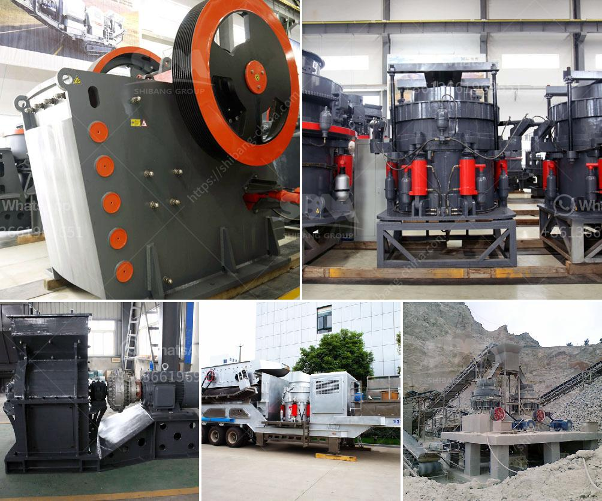

<h3>chinese diesel propelled stone crushers for sale</h3>
Chinese diesel propelled stone crushers are available for sale in a variety of different sizes and models. These machines have numerous industrial applications including crushing stones for road construction, mineral processing, building materials manufacturing, cement production, etc. The crushers are versatile and highly efficient machines that are meant to help increase productivity, while being cost-effective.

One of the main advantages of diesel propelled stone crushers is that they are not dependent on electricity. This means that they can be easily used in remote areas where there is a limited access to electricity or in places that suffer from frequent power outages. These crushers are powered by diesel engines, which are known for their reliability and durability. The diesel engines provide the necessary power to run the crushers and also ensure continuous operation even in harsh working conditions.

The Chinese diesel propelled stone crushers for sale are in great demand in a variety of industries. These include metallurgy, mining, construction, automotive manufacturing, oil and gas, and even food processing. These industries require crushed stones of various sizes for different applications, such as road construction, building foundations, land reclamation, and concrete production. The stone crushers effectively crush the stones into desired sizes, which can then be used as raw materials in various construction projects.

Moreover, the Chinese diesel propelled stone crushers are also popular among small and medium-sized enterprises (SMEs) and individuals. They are affordable and easy to operate, making them an ideal choice for those with limited budgets or for individuals who need to carry out small construction projects. These crushers can be easily transported to different locations, making them highly flexible and convenient for use in different job sites.

In addition to their versatility and mobility, Chinese diesel propelled stone crushers are also known for their high production capacity. They have powerful engines that can crush large quantities of stones in a short time span. This is particularly beneficial in time-sensitive projects, where the demand for crushed stones is high. The efficient crushing process also ensures minimal wastage, thereby reducing the overall cost of the project.

Chinese diesel propelled stone crushers for sale are backed by a comprehensive after-sales service and support system. Chinese manufacturers understand the importance of providing excellent customer service and ensuring that their products continue to perform well even after the sale has been made. This includes providing necessary spare parts, routine maintenance, and technical support.

In conclusion, Chinese diesel propelled stone crushers offer a cost-effective and reliable solution for crushing stones. They are highly versatile machines that find wide applications in various industries, including construction, mining, and manufacturing. Moreover, their affordability and easy operation make them suitable for small-scale projects and individuals. Chinese manufacturers prioritize customer satisfaction and provide a comprehensive after-sales service, ensuring that their crushers continue to perform efficiently for a long time. Whether it's for large-scale industrial projects or small-scale construction activities, Chinese diesel propelled stone crushers can be an excellent choice.
<h3>Contact us</h3><ul><li><strong>Whatsapp:&nbsp;<a href="https://wa.me/8613661969651">+8613661969651</a></strong></li><li><a href="https://swt.shibang-china.com/?git&amp;zhl&amp;chinese diesel propelled stone crushers for sale"><strong>Online Service(chat now)</strong></a></li></ul><h3>Related</h3><ul><li><a href='concrete aggregates crushing plant for sale.md'>concrete aggregates crushing plant for sale</a></li><li><a href='crusher for limestone.md'>crusher for limestone</a></li><li><a href='small grinding mill machine in india.md'>small grinding mill machine in india</a></li><li><a href='quarry causer machine.md'>quarry causer machine</a></li><li><a href='graphite mining equipment in madagascar suppliers.md'>graphite mining equipment in madagascar suppliers</a></li></ul>