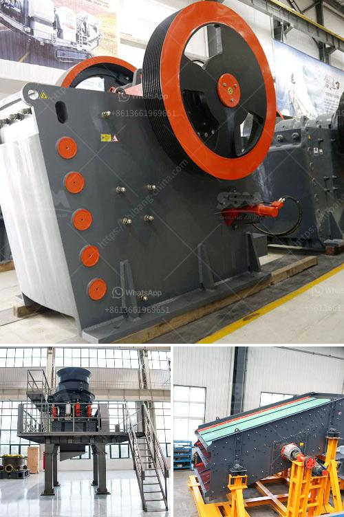

<h3>chinese gold mill low price wet ball mill in sudan</h3>
The resource-rich country of Sudan has been attracting the interest of investors from all over the world, particularly China. Chinese companies have been actively involved in various sectors of the Sudanese economy, including mining. One of the most significant contributions made by Chinese companies to the Sudanese mining industry is the introduction of low-price wet ball mills for gold processing.

The wet ball mill is a key equipment for grinding a variety of ores, such as gold, iron, lead, zinc, copper, etc. Its working principle is to crush the material after it is crushed, while rotating the cylinder around its horizontal axis. The grinding medium in the cylinder is steel balls. Under the impact and grinding action of the steel balls, the material is ground into fine powder.

Chinese gold mills are known for their high efficiency and low operating costs. The wet ball mills produced by Chinese manufacturers not only have advanced technology but also have a competitive price advantage over similar equipment from other countries. This affordability makes Chinese wet ball mills highly sought after by Sudanese gold miners.

One of the significant advantages of the Chinese gold mill is its low power consumption. The wet ball mill uses a unique combination of rolling friction and impact grinding that helps reduce energy consumption. This energy-saving feature is particularly beneficial for Sudan, where electricity prices are relatively high. By utilizing Chinese gold mills, Sudanese gold miners can significantly minimize their operational costs and maximize their profits.

Furthermore, Chinese wet ball mills are highly reliable and require minimal maintenance. They are designed to withstand the harsh conditions often encountered in gold mining operations, such as high temperatures, dust, and abrasive materials. This ensures that the mills have a long lifespan and minimal downtime, allowing for continuous and efficient gold processing.

The Chinese gold mills are also customizable, allowing them to meet the specific requirements of Sudanese gold miners. The size, capacity, and output of the wet ball mills can be tailored to suit the needs of different mining operations. This flexibility enables miners to optimize their gold processing operations and achieve higher recovery rates.

In addition to its economic benefits, the introduction of Chinese gold mills in Sudan has also had positive social impacts. The employment opportunities created by these mills have helped alleviate poverty and improve living standards for local communities. Moreover, the transfer of technological knowledge and expertise from Chinese manufacturers to Sudan has contributed to the skill development and capacity building of the Sudanese workforce.

In conclusion, the Chinese gold mill with its low price, high efficiency, and low operating costs has revolutionized the gold mining industry in Sudan. Chinese wet ball mills have become the go-to equipment for gold processing due to their affordability, energy efficiency, reliability, and customization options. As Sudan continues to attract foreign investment, especially from China, its gold mining sector is poised for further growth and success.
<h3>Contact us</h3><ul><li><strong>Whatsapp:&nbsp;<a href="https://wa.me/8613661969651">+8613661969651</a></strong></li><li><a href="https://swt.shibang-china.com/?git&amp;zhl&amp;chinese gold mill low price wet ball mill in sudan"><strong>Online Service(chat now)</strong></a></li></ul><h3>Related</h3><ul><li><a href='rotary vacuum paddle dryer india.md'>rotary vacuum paddle dryer india</a></li><li><a href='stone crusher manufacturer turkey.md'>stone crusher manufacturer turkey</a></li><li><a href='small scale electric arc ferrochrome smelting.md'>small scale electric arc ferrochrome smelting</a></li><li><a href='grinding mill machine.md'>grinding mill machine</a></li><li><a href='quartz powder manufacturing equipments.md'>quartz powder manufacturing equipments</a></li></ul>