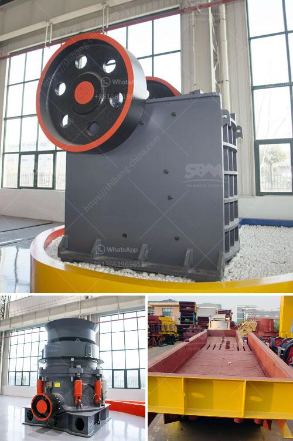

<h3>chinese mobile crusher</h3>
The rapid development of China's economy has led to the continuous expansion of its construction industry. As a result, the demand for durable and reliable construction equipment, such as mobile crushers, is increasing at a rapid pace. In recent years, Chinese mobile crusher manufacturers have been expanding their presence in overseas markets due to the growing demand for these crushers.

Chinese mobile crushers are equipped with advanced technology and are capable of crushing various types of rocks and ores, including iron ore, copper ore, limestone, granite, basalt, quartz, etc. They can be used for primary, secondary, and fine crushing to meet different crushing needs. With their compact and portable design, Chinese mobile crushers can be easily transported and installed at construction sites, reducing transportation costs and improving working efficiency.

One of the key advantages of Chinese mobile crushers is their affordability. Compared to their counterparts from other countries, Chinese crushers are more cost-effective, making them a popular choice for construction companies with limited budgets. Additionally, Chinese mobile crushers boast high crushing efficiency and low operational costs, which further enhance their appeal to construction professionals.

Another notable feature of Chinese mobile crushers is their versatility. They are designed to be highly adaptable to different working environments and can be used in a wide range of applications. Whether it is in mining, quarrying, or recycling, Chinese mobile crushers can effectively process various materials and deliver excellent crushing performance. This versatility makes them an asset for construction companies that handle multiple projects with diverse requirements.

Chinese mobile crushers have taken advantage of advanced manufacturing technologies to ensure their product quality. These crushers are built to withstand the toughest working conditions and are highly durable. They are also equipped with advanced safety features to protect operators and prevent accidents. In addition, Chinese manufacturers provide comprehensive after-sales support, including spare parts and technical assistance, which further enhances the reliability and longevity of their products.

Chinese mobile crushers have gained recognition in both domestic and international markets. They have been exported to numerous countries, such as Russia, Southeast Asia, Africa, and South America, where they are playing a crucial role in infrastructure development and construction projects. Their ability to provide efficient and cost-effective crushing solutions has made them a preferred choice for many construction companies worldwide.

In conclusion, Chinese mobile crushers have emerged as a leading player in the global construction equipment market. With their affordability, versatility, and superior performance, these crushers offer significant benefits to construction companies. The continuous innovation and improvement by Chinese manufacturers have solidified their position in the mobile crusher industry. As the demand for construction equipment continues to rise, Chinese mobile crushers are poised to seize further market opportunities both at home and abroad.
<h3>Contact us</h3><ul><li><strong>Whatsapp:&nbsp;<a href="https://wa.me/8613661969651">+8613661969651</a></strong></li><li><a href="https://swt.shibang-china.com/?git&amp;zhl&amp;chinese mobile crusher"><strong>Online Service(chat now)</strong></a></li></ul><h3>Related</h3><ul><li><a href='jaw crusher for hire south africa for limestone.md'>jaw crusher for hire south africa for limestone</a></li><li><a href='mobile crusher capacity 200 ton per hour.md'>mobile crusher capacity 200 ton per hour</a></li><li><a href='business plan for clinker grinding plant.md'>business plan for clinker grinding plant</a></li><li><a href='crusher plants in kuwait.md'>crusher plants in kuwait</a></li><li><a href='indonesia hammer mill for sale.md'>indonesia hammer mill for sale</a></li></ul>