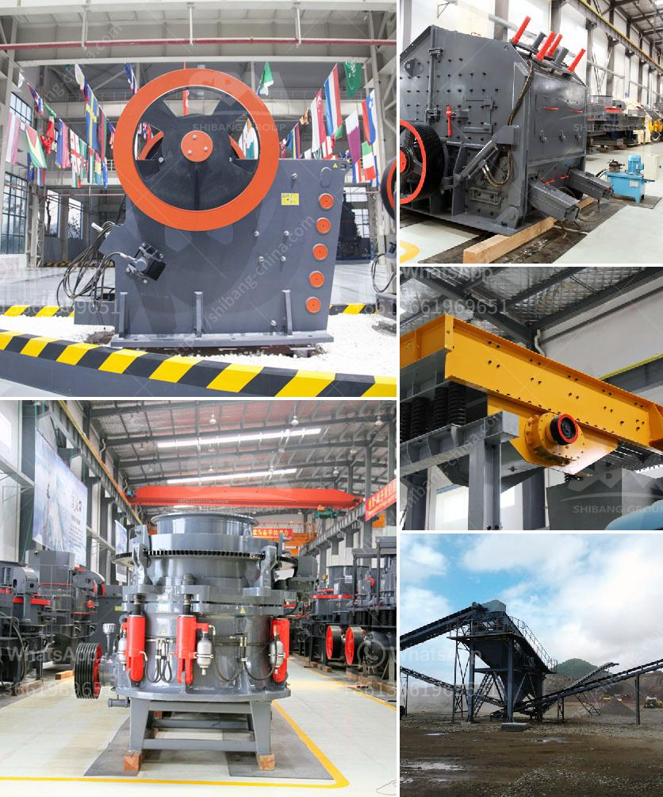

<h3>chrome ore concentrate plant</h3>
Chrome ore is a key ingredient in the production of stainless steel, an essential material used in various industries such as construction, automotive, consumer goods, and many more. To meet the increasing demand for this valuable resource, chrome ore concentrate plants have been set up across the globe.

A chrome ore concentrate plant, also known as a chrome beneficiation plant, is a facility that separates the valuable chrome ore from waste rock, tailings, and impurities using various techniques such as gravity separation, flotation, magnetic separation, and electrostatic separation. The resulting chrome concentrate is then used in various industrial processes.

The primary objective of a chrome ore concentrate plant is to increase the chrome content in the ore and reduce the impurities to obtain a higher quality chrome concentrate. This is achieved through a series of processing steps, including crushing, grinding, milling, and beneficiation. By using these methods, the plant ensures that only the most valuable chrome ore is extracted and processed, while minimizing the amount of waste produced.

One of the main features of a chrome ore concentrate plant is its high throughput capacity. These plants are designed to process large volumes of ore to ensure a continuous supply of chrome concentrate to meet market demands. Additionally, they are equipped with advanced technologies and equipment that enable efficient processing and maximum recovery of valuable chrome ore.

The chrome ore concentrate produced in these plants is a vital raw material for the stainless steel industry. Stainless steel, known for its corrosion resistance, strength, and durability, is widely used in infrastructure, transportation, and consumer goods. As the demand for stainless steel continues to rise, the importance of chrome ore concentrate plants remains significant.

In conclusion, chrome ore concentrate plants play a crucial role in meeting the global demand for stainless steel. By extracting and processing valuable chrome ore, these plants produce high-quality chrome concentrates that are essential for the production of stainless steel. With their advanced technologies and high throughput capacity, these plants ensure a continuous supply of chrome concentrate for various industries.
<h3>Contact us</h3><ul><li><strong>Whatsapp:&nbsp;<a href="https://wa.me/8613661969651">+8613661969651</a></strong></li><li><a href="https://swt.shibang-china.com/?git&amp;zhl&amp;chrome ore concentrate plant"><strong>Online Service(chat now)</strong></a></li></ul><h3>Related</h3><ul><li><a href='stone crushers for sale in south africa.md'>stone crushers for sale in south africa</a></li><li><a href='small scale gold mining equipment for sale auction.md'>small scale gold mining equipment for sale auction</a></li><li><a href='project report on mini kaolin mining crusher.md'>project report on mini kaolin mining crusher</a></li><li><a href='diamond plant for sale in south africa.md'>diamond plant for sale in south africa</a></li><li><a href='cost of vertical roller mill.md'>cost of vertical roller mill</a></li></ul>