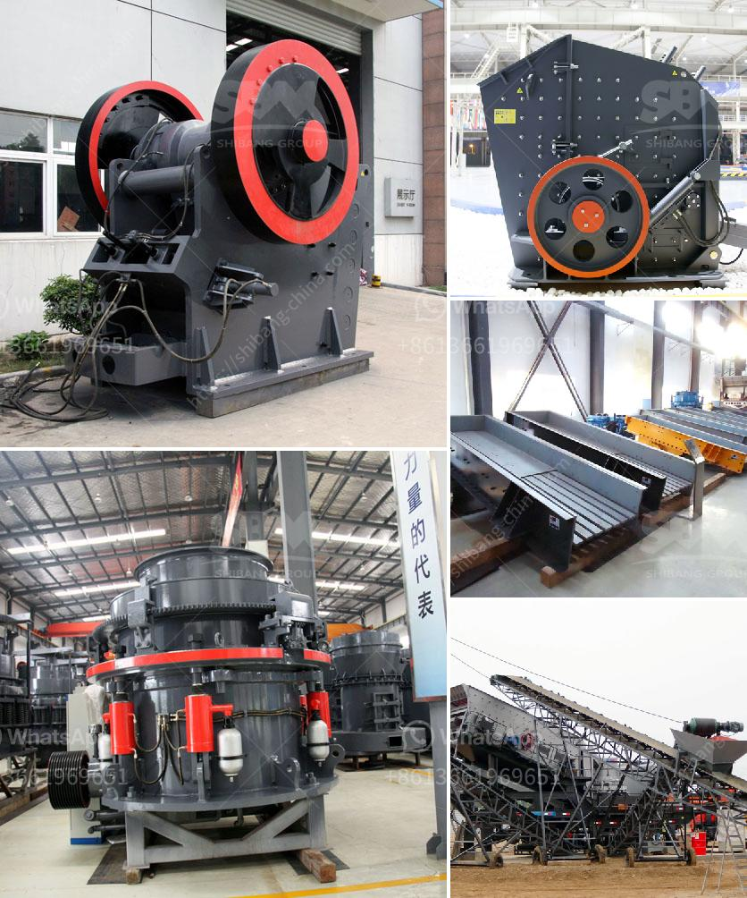

<h3>chrome ore price in south africa</h3>
South Africa is one of the largest producers of chrome ore in the world. The country's annual chrome ore production accounts for over 40% of global output, making it the leading chrome ore producer in the world. Much of this production is exported to various countries, including China, which is a major consumer of chrome ore. Due to its abundant reserves and favorable mining conditions, South Africa has become a significant player in the global chrome ore market.

The price of chrome ore has always been influenced by various factors, including global demand and supply, production costs, and exchange rates. In recent years, the chrome ore market has experienced some volatility, with prices fluctuating due to changing market conditions.

One of the key factors impacting chrome ore prices is the global demand for stainless steel. Chrome ore is a crucial ingredient in stainless steel production, as it provides the element chromium, which enhances the metal's corrosion resistance and durability. Therefore, the demand for stainless steel directly affects the demand for chrome ore.

The global stainless steel market has seen robust growth in recent years, driven by increasing industrialization, urbanization, and infrastructure development. This has led to a surge in demand for chrome ore, pushing up prices. Additionally, as the automotive and aerospace industries continue to expand, the demand for stainless steel is expected to rise further, thereby boosting the chrome ore market.

On the supply side, production costs play a crucial role in determining chrome ore prices. South Africa's chrome ore mining industry is characterized by high operational costs, including electricity, labor, and transportation expenses. These factors can affect the profitability of mining companies and influence the prices they set for chrome ore.

Furthermore, exchange rates also impact chrome ore prices. As South Africa is a significant chrome ore exporter, the value of the country's currency, the Rand, in relation to other global currencies affects the competitiveness of its exports. A stronger Rand can result in higher chrome ore prices, as mining companies may require more Rand to generate the same amount of revenue when exporting their products.

In recent years, chrome ore prices in South Africa have seen some fluctuations. The market experienced a decline in prices in 2020 due to the economic slowdown caused by the COVID-19 pandemic. However, prices have rebounded since then, driven by the recovery of global stainless steel demand and the gradual reopening of economies.

As the chrome ore market in South Africa remains highly competitive, mining companies are constantly seeking ways to optimize their operations and reduce costs. This includes adopting new technologies and improving efficiency in the mining and processing of chrome ore. By doing so, companies can maintain profitability and remain competitive in the global market.

In conclusion, the chrome ore market in South Africa is influenced by various factors, including global demand and supply, production costs, and exchange rates. The demand for stainless steel, driven by industrialization and infrastructure development, plays a significant role in determining chrome ore prices. Additionally, mining companies' operational costs and the value of the Rand also impact prices. Despite some fluctuations, the chrome ore market in South Africa is expected to remain strong, driven by the growth of the global stainless steel industry and ongoing infrastructural developments.
<h3>Contact us</h3><ul><li><strong>Whatsapp:&nbsp;<a href="https://wa.me/8613661969651">+8613661969651</a></strong></li><li><a href="https://swt.shibang-china.com/?git&amp;zhl&amp;chrome ore price in south africa"><strong>Online Service(chat now)</strong></a></li></ul><h3>Related</h3><ul><li><a href='automatic feeder for ball mill customer case.md'>automatic feeder for ball mill customer case</a></li><li><a href='hammer mill supplier in pretoria.md'>hammer mill supplier in pretoria</a></li><li><a href='artificial sand machine.md'>artificial sand machine</a></li><li><a href='belt conveyor system manufacturers.md'>belt conveyor system manufacturers</a></li><li><a href='ball mill for granulated slag.md'>ball mill for granulated slag</a></li></ul>