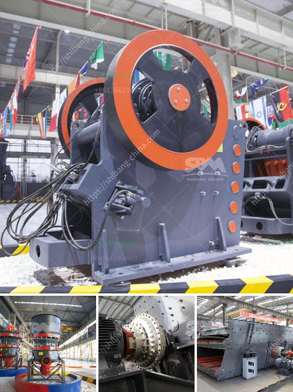

<h3>chrome ore processing plant price</h3>
Chrome ore processing plant is an integral part of the mining industry in many countries across the globe. It is primarily utilized in the production of stainless steel. The price of chrome ore varies based on the grade and quality of the ore. Investors also consider the availability of supply, market demand, and future trends when determining the price of chrome ore in the global market.

The chrome ore processing plant plays a crucial role in extracting valuable elements from ore by transforming them into a marketable product. The plant uses a combination of physical and chemical methods to concentrate the ore into a pure and usable form. The process involves crushing the ore into smaller particles, which are then further ground into a fine powder. The fine powder is then subjected to various physical and chemical processes to remove impurities and isolate the desired chrome content.

The price of chrome ore is influenced by several factors. The grade and quality of the ore, which determine the chrome content, significantly impact the price. Ore with higher chrome content is in higher demand and commands a higher price. Additionally, the market demand for stainless steel, which utilizes chrome ore as a key ingredient, plays a crucial role in determining the price. A high demand for stainless steel raises the price of chrome ore as well.

The supply availability also affects the price of chrome ore. In countries where chrome ore is abundantly available, the price tends to be lower due to higher supply levels. Conversely, if the supply is limited, the price of chrome ore increases. Therefore, investors closely monitor the supply chain and exploration activities to determine the future price trends.

Furthermore, government policies and regulations can also impact the price of chrome ore. Export restrictions, tariffs, and taxes imposed by countries can significantly affect the global chrome ore market and influence the price. Buyers and sellers must stay informed about any changes in government policies to make informed decisions regarding the purchase and sale of chrome ore.

Investing in a chrome ore processing plant offers great potential for profitability. With a steady supply of high-grade ore and a favorable market demand for stainless steel, the processing plant can generate substantial revenue. However, it is essential to consider the initial investment and operational costs associated with setting up and operating a processing plant. Factors such as labor, energy consumption, and maintenance expenses can affect the overall profitability of the plant.

In conclusion, the price of chrome ore in the global market is determined by multiple factors such as grade, quality, supply availability, market demand, government policies, and future trends. Investors must conduct thorough research and analysis before investing in a chrome ore processing plant. By considering these factors, investors can make informed decisions and potentially capitalize on the profitability of the chrome ore industry.
<h3>Contact us</h3><ul><li><strong>Whatsapp:&nbsp;<a href="https://wa.me/8613661969651">+8613661969651</a></strong></li><li><a href="https://swt.shibang-china.com/?git&amp;zhl&amp;chrome ore processing plant price"><strong>Online Service(chat now)</strong></a></li></ul><h3>Related</h3><ul><li><a href='hammer mill bison price.md'>hammer mill bison price</a></li><li><a href='manufacture of hammer mill.md'>manufacture of hammer mill</a></li><li><a href='conveyor belts in coacalco de berriozabal.md'>conveyor belts in coacalco de berriozabal</a></li><li><a href='sand mining equipment manufacturer in south africa.md'>sand mining equipment manufacturer in south africa</a></li><li><a href='barite crusher manufacturer guatemala.md'>barite crusher manufacturer guatemala</a></li></ul>