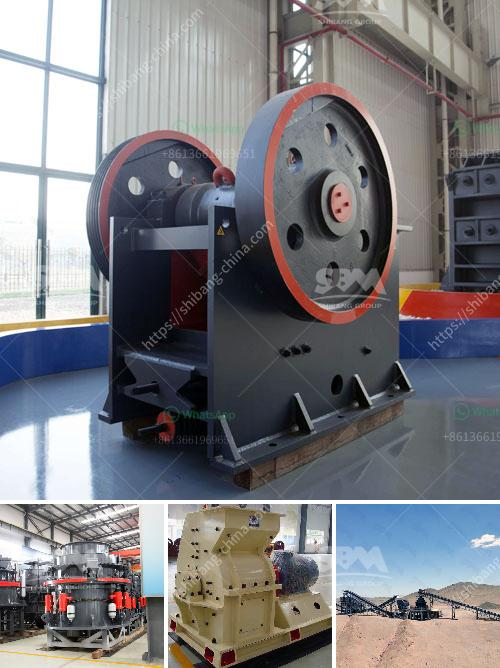

<h3>chrome processing plant price</h3>
Chrome, also known as chromium, is a crucial element used in various industries, including stainless steel production, refractories, and foundries. As the demand for chrome continues to rise, the need for efficient chrome processing plants becomes more significant. This article aims to provide a comprehensive guide on chrome processing plant prices, factors that contribute to the cost, and the current market trends.

When it comes to chrome processing plant prices, several factors come into play. The cost of establishing a chrome processing plant can vary depending on the scale, location, and technology used. Generally, the price range for a small-scale chrome processing plant starts from around $2 million, whereas a larger industrial plant could cost up to $20 million or more.

One of the primary cost determinants is the capacity of the plant. A small-scale plant may have an annual processing capacity of around 10,000 metric tons, while larger plants can process hundreds of thousands of metric tons per year. Higher processing capacity usually means more advanced technology and machinery, resulting in increased costs.

The location of the processing plant also impacts the price. Establishing a plant in areas rich in chrome deposits is advantageous due to reduced transportation costs. Countries like South Africa, Zimbabwe, and Kazakhstan are known for their abundant chrome reserves, making them attractive locations for setting up chrome processing plants. On the other hand, constructing a plant in countries far from chrome mines would require additional logistics, increasing the overall expenses.

Moreover, the level of technology employed in the processing plant plays a significant role in determining the cost. Modern plants utilize advanced machinery and automation systems to enhance efficiency and reduce labor costs. However, this also results in higher initial investments. The use of innovative technologies, such as gravity separation, flotation, and magnetic separation, further adds to the total plant price.

Apart from these factors, the price can also be influenced by the availability and cost of electricity, water, and other essential resources. Quality certifications, environmental regulations, and labor costs can also impact the overall expense of setting up and operating a chrome processing plant.

In recent years, the chrome market has witnessed volatile price fluctuations due to factors such as geopolitical tensions, global economic conditions, and supply-demand dynamics. Despite such uncertainties, the demand for chrome remains strong, particularly in emerging economies like China and India, where infrastructure development, urbanization, and industrialization are driving the need for stainless steel and other chrome-related products.

The chrome processing plant market is also witnessing technological advancements geared towards sustainability and environmental protection. Many companies are investing in innovative technologies to reduce energy consumption, minimize waste generation, and enhance the overall efficiency of the processing plants. These advancements contribute to the overall cost of setting up a chrome processing plant, but they also offer long-term benefits such as resource conservation and reduced environmental impact.

In conclusion, the price of a chrome processing plant depends on various factors, including its scale, location, technology used, and market dynamics. While smaller plants can cost around $2 million, larger industrial plants can surpass $20 million or more. The demand for chrome, especially in the stainless steel industry, continues to rise, making investments in chrome processing plants potentially lucrative. As the market evolves, integrating advanced technologies and sustainable practices will be crucial for the long-term success and profitability of chrome processing plants.
<h3>Contact us</h3><ul><li><strong>Whatsapp:&nbsp;<a href="https://wa.me/8613661969651">+8613661969651</a></strong></li><li><a href="https://swt.shibang-china.com/?git&amp;zhl&amp;chrome processing plant price"><strong>Online Service(chat now)</strong></a></li></ul><h3>Related</h3><ul><li><a href='china multifunction peeling and crushing.md'>china multifunction peeling and crushing</a></li><li><a href='biggest cone crusher in africa.md'>biggest cone crusher in africa</a></li><li><a href='items for conveyor belts.md'>items for conveyor belts</a></li><li><a href='stone crusher machine in turkey.md'>stone crusher machine in turkey</a></li><li><a href='price jaw crusher pdf.md'>price jaw crusher pdf</a></li></ul>