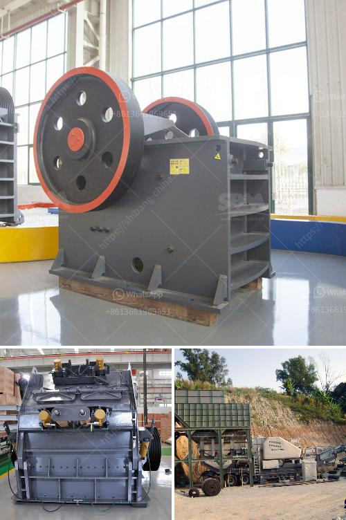

<h3>chrome washing plant for sale south africa</h3>
Chrome is a mineral rich in chromium, which is used widely across various industries such as metallurgy, chemical, refractory, and foundry. This versatile mineral is in high demand globally, and South Africa holds an abundant reserve of chrome ore, making it a leading exporter of chrome ore. To meet this demand, chrome washing plants are used to extract and separate chrome from the ore, ensuring its purity and usability. These plants play a crucial role in South Africa's economy, and the sale of chrome washing plants has become a profitable venture.

One of the leading chrome washing plant manufacturers in South Africa is Rand York Minerals (RYM). They are renowned for their high-quality chrome washing plants, which offer efficient and effective chrome recovery solutions. RYM's chrome washing plants are designed to suit specific ore types and are configured for optimum production. These plants are equipped with advanced technology, ensuring maximum chrome recovery and minimal environmental impact.

The chrome washing plant offered by RYM consists of various components that work together to produce high-grade chrome concentrate. The process begins with the crushing and screening of the raw ore, which is then fed into the washing plant. The ore undergoes multiple stages of washing, screening, and classification, which remove impurities and separate the chrome particles from other minerals. The chrome concentrate is then dewatered and finally dried before being packaged for sale.

The sale of chrome washing plants in South Africa provides an opportunity for investors and entrepreneurs to enter the lucrative chrome mining industry. These plants are in high demand, both domestically and internationally, as chrome is an essential component in various manufacturing processes. The rising demand for chrome in industries such as stainless steel, automotive, and aerospace has contributed to the increased sale of chrome washing plants.

Investing in a chrome washing plant offers several advantages. Firstly, it allows for the extraction and recovery of chrome from the ore, ensuring higher chrome yields and increased profitability. Additionally, chrome washing plants contribute to job creation and economic growth in South Africa. The operation and maintenance of these plants require skilled labor, providing employment opportunities for local communities. Moreover, the export of chrome concentrate generated from these plants boosts South Africa's revenue from the mining sector.

However, there are also challenges associated with the sale of chrome washing plants in South Africa. The chrome mining industry is highly competitive, with multiple players vying for market share. To remain competitive, plant manufacturers need to continuously innovate and improve their technology and processes. Additionally, the fluctuating prices of chrome in the international market can impact the profitability of chrome washing plant operations.

In conclusion, the sale of chrome washing plants in South Africa presents immense opportunities for entrepreneurs and investors. With its abundant chromium reserve, South Africa is a leading exporter of chrome ore, and chrome washing plants are crucial for extracting and separating chrome from the ore to meet global demand. The high-grade chrome concentrate produced by these plants is essential for various industries, making the sale of chrome washing plants a profitable venture. However, it is important to address the challenges associated with this industry to ensure future growth and sustainability.
<h3>Contact us</h3><ul><li><strong>Whatsapp:&nbsp;<a href="https://wa.me/8613661969651">+8613661969651</a></strong></li><li><a href="https://swt.shibang-china.com/?git&amp;zhl&amp;chrome washing plant for sale south africa"><strong>Online Service(chat now)</strong></a></li></ul><h3>Related</h3><ul><li><a href='granite crushing process.md'>granite crushing process</a></li><li><a href='ton per hour gold wash plant.md'>ton per hour gold wash plant</a></li><li><a href='3 mesh vibrating screen.md'>3 mesh vibrating screen</a></li><li><a href='mobile crusher indonesia.md'>mobile crusher indonesia</a></li><li><a href='cement plant drawings pdf.md'>cement plant drawings pdf</a></li></ul>