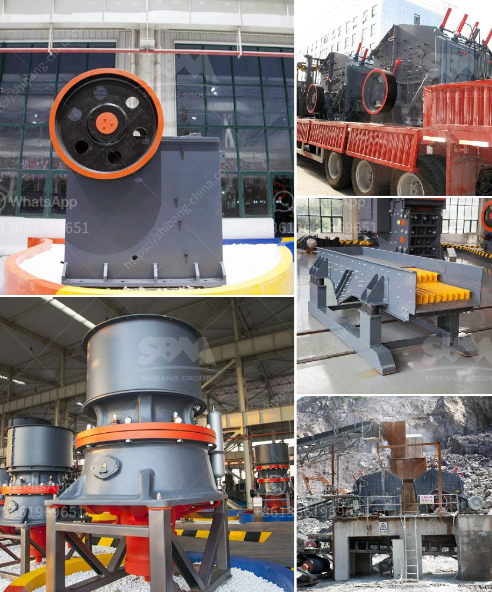

<h3>chromium ore mining equipmentr</h3>
Chromium is a versatile metal used in various industries for its corrosion resistance and high melting point properties. One of the major sources of this metal is chromium ore mining, where the extraction and refining process require specialized equipment.

In chromium ore mining, the first step is to extract the raw material from the mine. This is done through underground or surface mining methods, depending on the location and accessibility of the deposit. Surface mining involves the removal of soil and rock layers to expose the ore, while underground mining requires tunnels and shafts to access the deposit.

Once the ore is extracted, it undergoes a series of processing steps to obtain pure chromium metal. These steps include crushing the ore into smaller pieces, followed by grinding and milling to further reduce the size. The ore is then heated in a furnace to separate the impurities from the chromium. This process is known as smelting and requires high temperatures to achieve the desired outcome.

To facilitate these complex mining and processing operations, specialized equipment is used. Heavy-duty machinery such as excavators, loaders, and dump trucks are employed in surface mining to remove and transport the ore. In underground mining, drilling rigs and dynamite are used to create tunnels, while conveyor systems and hoists help move the ore to the surface.

In addition to these primary mining equipment, various supporting machinery and technologies are utilized. This includes pumps, ventilation systems, and safety equipment to ensure the wellbeing of the workers. Moreover, advanced technologies are employed to automate certain tasks and improve productivity.

Chromium ore mining equipment plays a crucial role in the entire production process. By ensuring the efficient extraction and refining of chromium, it enables industries to utilize this metal in manufacturing a wide range of products. From stainless steel and alloys to chrome plating and chemical compounds, chromium has an extensive use and its mining equipment is fundamental for its successful production.
<h3>Contact us</h3><ul><li><strong>Whatsapp:&nbsp;<a href="https://wa.me/8613661969651">+8613661969651</a></strong></li><li><a href="https://swt.shibang-china.com/?git&amp;zhl&amp;chromium ore mining equipmentr"><strong>Online Service(chat now)</strong></a></li></ul><h3>Related</h3><ul><li><a href='tractor mounted rock crusher uk.md'>tractor mounted rock crusher uk</a></li><li><a href='ball mill grinding and particle.md'>ball mill grinding and particle</a></li><li><a href='ball mills used for copper.md'>ball mills used for copper</a></li><li><a href='used jaw crusher for sale.md'>used jaw crusher for sale</a></li><li><a href='stone crusher manufacturer turkey.md'>stone crusher manufacturer turkey</a></li></ul>