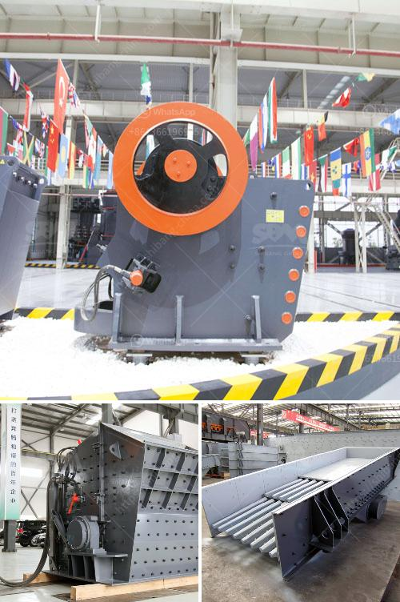

<h3>clay brick crusher manufacturers in pakistan</h3>
Clay brick crusher manufacturers in Pakistan have been more and more popular in mining market nowadays. There are numerous suppliers online who provide such equipment. But whether their products are of good quality or not remains a concern for customers. How to distinguish a reliable supplier of clay brick crushing machinery in Pakistan?

Clay brick crusher manufacturers have different exhibitions and sales methods. They will always show their advantages in the aspects of production capacity, investment benefit, and operation convenience. From the above introduction, we can see that Pakistan clay brick making machine manufacturers have made great efforts in terms of theory and technology in recent years. They are eager to bring more business opportunities to customers and better serve customers.

So, what are the advantages of Pakistan clay brick making machine manufacturers? Firstly, they have strong comprehensive strength. Manufacturers with strong comprehensive strength usually have a good reputation in the industry and a high credibility. At the same time, they have a complete production system, including processing, manufacturing, and assembling. It can guarantee the quality and delivery time of the equipment.

Secondly, reliable clay brick crusher manufacturers have professional technical guidance. Before the equipment is shipped, the manufacturer will send professional technicians to guide the installation and operation. This is very important for the customers, as it can avoid unnecessary problems in the process of using the clay brick crusher machine.

Thirdly, the after-sales service is also an important aspect to consider. After the equipment is delivered to the customer's site, the manufacturer should provide perfect after-sales service to ensure that the customer can solve various technical problems encountered in the process of using the equipment in time. This can greatly increase the customer's confidence in the manufacturer and their products.

As mentioned above, it is necessary to choose a reliable clay brick crusher manufacturer in Pakistan before purchasing the machine. To choose a good manufacturer, we should consider factors such as reputation, comprehensive strength, technical guidance, and after-sales service. Only by choosing a reliable manufacturer can we ensure the quality of the equipment and get timely and efficient after-sales service.

In summary, the development of Pakistan clay brick crusher manufacturers should focus on the core requirements of customers, such as continuous innovation, quality, reliability, and after-sales service. Under such conditions, users can purchase equipment that meets their own needs, and equipment manufacturers can develop in the fierce market competition. Clay brick crusher manufacturers in Pakistan must continue to intensify innovation and enhance their competitiveness in order to develop faster in the increasingly competitive market environment.  Overall, the clay brick crusher manufacturers in Pakistan are trustworthy.
<h3>Contact us</h3><ul><li><strong>Whatsapp:&nbsp;<a href="https://wa.me/8613661969651">+8613661969651</a></strong></li><li><a href="https://swt.shibang-china.com/?git&amp;zhl&amp;clay brick crusher manufacturers in pakistan"><strong>Online Service(chat now)</strong></a></li></ul><h3>Related</h3><ul><li><a href='vertical shaft impact crusher for sale.md'>vertical shaft impact crusher for sale</a></li><li><a href='price for china crusher.md'>price for china crusher</a></li><li><a href='operation crushing plant.md'>operation crushing plant</a></li><li><a href='gypsum manufacturing machine.md'>gypsum manufacturing machine</a></li><li><a href='sizing jaw crusher.md'>sizing jaw crusher</a></li></ul>