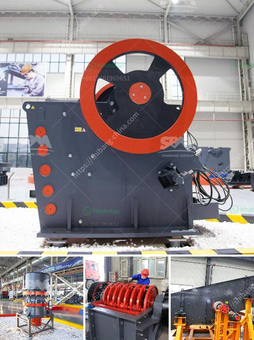

<h3>clay brick making equipment south africa</h3>
Clay brick making is an ancient practice that has been passed down through generations. In South Africa, clay bricks have been used as a building material for centuries, thanks to their durability and resistance to harsh weather conditions. With the advancement of technology, clay brick making equipment in South Africa has also evolved, making the process more efficient and productive.

Traditionally, clay brick making involved manual labor, where clay was mixed with water, shaped, and sun-dried. However, modern methods have revolutionized the process, reducing the time and effort required. Today, there are various types of clay brick making equipment available in South Africa that cater to different production needs.

One popular type of equipment is the clay brick making machine. These machines automate the entire brick-making process, from mixing the clay to shaping and finally firing the bricks. With the help of these machines, large quantities of clay bricks can be produced in a shorter period, enabling builders and construction companies to meet their project deadlines more effectively.

Another type of equipment widely used in South Africa is the clay extruder. This machine has a cylindrical barrel, which pushes the clay through a die to obtain the desired brick shape. The extruder can produce bricks of different sizes and designs, providing flexibility for architects and builders. These bricks are then air-dried or kiln-fired, depending on the specific requirements.

The use of clay brick making equipment in South Africa has not only increased productivity but also improved the quality of the bricks. The machines ensure that the clay mixture is uniform and well-mixed, resulting in bricks with consistent dimensions and strength. Additionally, the firing process in kilns further enhances the durability and endurance of the bricks.

In conclusion, clay brick making equipment in South Africa has evolved to meet the demands of the construction industry. These modern machines have made the process more efficient, allowing for increased production and improved quality. As a traditional building material, clay bricks continue to stand the test of time, providing durability, strength, and aesthetics to buildings in South Africa and beyond.
<h3>Contact us</h3><ul><li><strong>Whatsapp:&nbsp;<a href="https://wa.me/8613661969651">+8613661969651</a></strong></li><li><a href="https://swt.shibang-china.com/?git&amp;zhl&amp;clay brick making equipment south africa"><strong>Online Service(chat now)</strong></a></li></ul><h3>Related</h3><ul><li><a href='feldspar stone crusher.md'>feldspar stone crusher</a></li><li><a href='grinding mill machine kenya.md'>grinding mill machine kenya</a></li><li><a href='rental mobile stone crusher machine in malaysia.md'>rental mobile stone crusher machine in malaysia</a></li><li><a href='clinker grinding plant.md'>clinker grinding plant</a></li><li><a href='china gold stamp mills for sale in south africa.md'>china gold stamp mills for sale in south africa</a></li></ul>