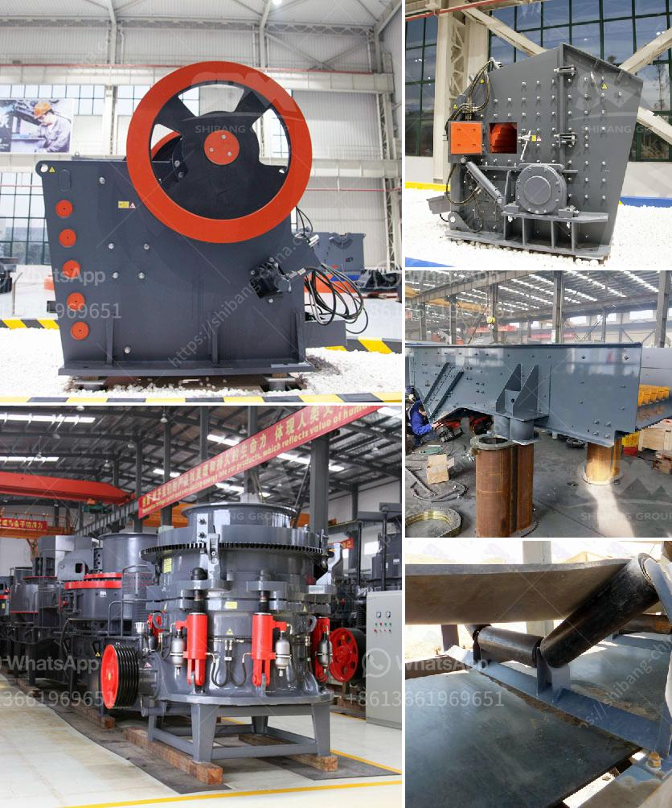

<h3>clinker grinding plant</h3>
Clinker grinding refers to the process of grinding the clinker nodules produced in cement production. This process is vital in the production of high-quality cement and requires the use of specialized equipment in a clinker grinding plant.

A clinker grinding plant is a straight forward process. The clinker is transported to feed hopper, which feeds it into the pre-crusher, table feeders extract it out form the pre-crusher and feed it into a Ball mill, blending of this fine powder with gypsum and other additives makes it the portland cement, Packing Plant and Material Handling equipment completes the offers.

Clinker grinding plants can be established at different locations, including near limestone mines or railways stations. The clinker is ground to a fine powder in a cement mill and mixed with gypsum to create cement. Several packaging plants are used to distribute the finished cement products to the consumers.

A clinker grinding plant can be a creative solution to reduce energy consumption and production costs, without compromising quality and safety of the final product. This is achieved through consistent monitoring, control and optimization of each stage of the production process.

Additionally, a clinker grinding plant can facilitate the recycling of waste products of cement production, such as slag, fly ash, and other supplementary cementitious materials. These waste products can be used as additives or blended with the clinker during the grinding process, resulting in eco-friendly cement with enhanced properties.

Investing in a clinker grinding plant can be beneficial for cement manufacturers who want to achieve higher profit margins, improve their cement quality, and contribute to sustainable development. By optimizing the grinding process, these plants can save energy, reduce CO2 emissions, and decrease the environmental impact of cement production.

In conclusion, a clinker grinding plant is a vital process in the production of high-quality cement. It enables manufacturers to reduce energy consumption and improve the quality of the final product. Additionally, utilizing waste products as additives can contribute to environmental sustainability. Cement manufacturers who invest in a clinker grinding plant can reap various benefits, including higher profit margins, improved cement quality, and a reduced environmental impact.
<h3>Contact us</h3><ul><li><strong>Whatsapp:&nbsp;<a href="https://wa.me/8613661969651">+8613661969651</a></strong></li><li><a href="https://swt.shibang-china.com/?git&amp;zhl&amp;clinker grinding plant"><strong>Online Service(chat now)</strong></a></li></ul><h3>Related</h3><ul><li><a href='mini stone crusher price in south africa.md'>mini stone crusher price in south africa</a></li><li><a href='crushers mobile crushers american mobile.md'>crushers mobile crushers american mobile</a></li><li><a href='stone sand making machine.md'>stone sand making machine</a></li><li><a href='lister petter maize hammer mills.md'>lister petter maize hammer mills</a></li><li><a href='mill to pulverize stone crusher.md'>mill to pulverize stone crusher</a></li></ul>