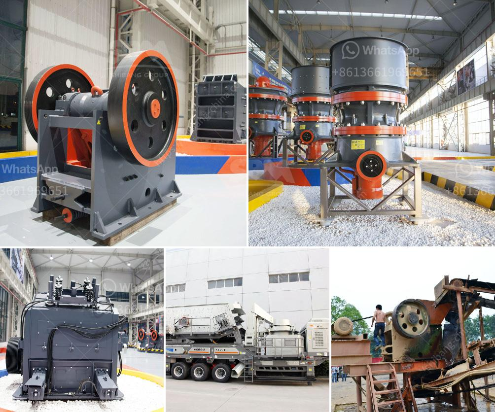

<h3>coal charcoal crushing grinding machine small</h3>
Coal charcoal crushing grinding machine small is a highly efficient and environmentally friendly product. Among them, the main structure is composed of a feeding device, a crushing device, a steering device, a discharge device, a transmission device, and a motor. The motor drives the crushing device to rotate at a high speed. As the material enters the crushing chamber, it is crushed into a fine powder by the high-speed rotating hammer. The crushed charcoal particles are then discharged through the discharge device.

This coal charcoal crushing grinding machine small is widely used in various industries and has a wide range of applications. It can crush coal, charcoal, slag, and other materials. The machine is compact in structure, easy to operate, and convenient to maintain, making it an ideal choice for small and medium-sized enterprises.

One of the main advantages of this coal charcoal crushing grinding machine small is its high efficiency. The machine is equipped with high-quality hammers, which can crush materials quickly and efficiently. The crushing chamber is designed with a unique V-shaped structure, which effectively improves the crushing efficiency and reduces the energy consumption. Moreover, the machine is equipped with a powerful motor, which provides strong power for the crushing process.

In addition to its high efficiency, this coal charcoal crushing grinding machine small is also environmentally friendly. The machine is equipped with a dust collector, which can effectively collect the dust generated during the crushing process, greatly reducing the pollution to the environment. The machine also has a low noise operation, which can effectively reduce the noise pollution and create a comfortable working environment.

Furthermore, this coal charcoal crushing grinding machine small is easy to operate and maintain. The machine is equipped with a fully automatic control system, which can realize the automatic crushing and discharge of materials. The machine also has a simple and compact structure, which makes it easy to operate and maintain. The replacement of wearing parts is also very convenient, which can greatly reduce the maintenance cost and improve the service life of the machine.

In conclusion, the coal charcoal crushing grinding machine small is a highly efficient and environmentally friendly product. It is widely used in various industries and has a wide range of applications. The machine is characterized by its high efficiency, low noise operation, and easy operation and maintenance. It is an ideal choice for small and medium-sized enterprises. By using this machine, enterprises can not only improve the efficiency of production but also protect the environment and create a green workshop.
<h3>Contact us</h3><ul><li><strong>Whatsapp:&nbsp;<a href="https://wa.me/8613661969651">+8613661969651</a></strong></li><li><a href="https://swt.shibang-china.com/?git&amp;zhl&amp;coal charcoal crushing grinding machine small"><strong>Online Service(chat now)</strong></a></li></ul><h3>Related</h3><ul><li><a href='hammer mill bison price.md'>hammer mill bison price</a></li><li><a href='aggregate processing equipment.md'>aggregate processing equipment</a></li><li><a href='basalt crushing plant.md'>basalt crushing plant</a></li><li><a href='mobile stone crusher for sale in philippines.md'>mobile stone crusher for sale in philippines</a></li><li><a href='gypsum crusher supplier in uae.md'>gypsum crusher supplier in uae</a></li></ul>