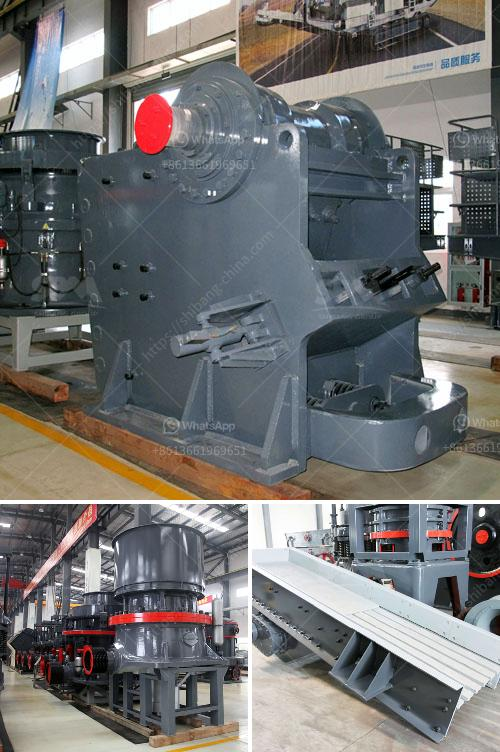

<h3>coal crusher 10mm</h3>
Coal, a fossil fuel, is the largest source of energy for the generation of electricity worldwide. Due to its relatively cheap and abundant nature, coal is preferred over other fossil fuels for electricity generation. But before it is utilized in the power plants, it needs to be crushed into smaller pieces so that it can find its way into the boilers.

A coal crusher 10mm is a machine that breaks coal into smaller particle sizes. The coal crusher 10mm is designed to crush coal and agglomerate it before it is used in a coal-fired power plant or other industries that require coal. The machine has a unique design with a rotating shaft that vertically travels up and down to crush coal into 10mm-sized pieces. The coal particles are then transported to the coal handling system for further processing or storage.

The coal crusher 10mm has several advantages over traditional crushers used for coal crushing. First, it uses less energy during the crushing process. This is because the coal crusher 10mm relies on the rotation of the shaft to crush coal, which requires less power compared to other crushers that rely on a reciprocating motion. As a result, the coal crusher 10mm is more energy-efficient and cost-effective.

Second, the coal crusher 10mm produces uniform-sized coal particles. This is crucial for power plants as coal with consistent particle sizes burns more efficiently, resulting in higher energy output. By achieving a 10mm particle size, the coal crusher ensures that the coal particles are of the optimal size for combustion, reducing waste and maximizing energy production.

Furthermore, the coal crusher 10mm is designed to be durable and reliable. It is built with high-quality materials that can withstand the harsh conditions of coal processing plants. The machine also features safety mechanisms to prevent any accidents or malfunctions during operation. This ensures that the coal crusher 10mm can be relied upon for efficient and uninterrupted crushing of coal.

In conclusion, the coal crusher 10mm plays a crucial role in the coal processing industry. With its unique design and features, it is an essential machine for crushing coal into smaller particle sizes. The coal crusher 10mm offers numerous advantages, including energy efficiency, uniform particle size distribution, and durability. By utilizing this machine, power plants and other industries can optimize their coal processing operations, resulting in improved efficiency and higher energy output.
<h3>Contact us</h3><ul><li><strong>Whatsapp:&nbsp;<a href="https://wa.me/8613661969651">+8613661969651</a></strong></li><li><a href="https://swt.shibang-china.com/?git&amp;zhl&amp;coal crusher 10mm"><strong>Online Service(chat now)</strong></a></li></ul><h3>Related</h3><ul><li><a href='the cost of chrome washing plants in south africa.md'>the cost of chrome washing plants in south africa</a></li><li><a href='quarry causer machine.md'>quarry causer machine</a></li><li><a href='limestone crusher plant made in pakistan price.md'>limestone crusher plant made in pakistan price</a></li><li><a href='iron ore crusher plant.md'>iron ore crusher plant</a></li><li><a href='double rotor hammer crusher.md'>double rotor hammer crusher</a></li></ul>