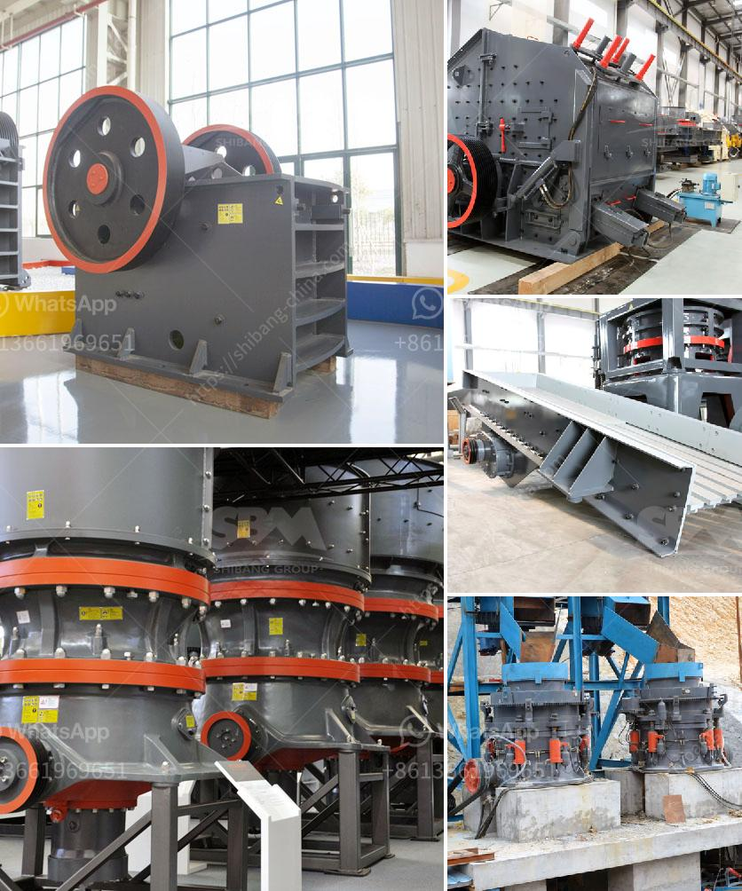

<h3>coal crusher manufacturer in mumbai</h3>
Coal, a fossil fuel, is the largest source of energy for the generation of electricity worldwide. Coal is extracted from the ground by mining, either underground or in open pits. Coal is primarily used as a solid fuel to produce electricity and heat through combustion. In Mumbai, the financial capital of India, coal is extensively used in various industries, making it imperative to have reliable coal crusher manufacturers to meet the growing demand from these industries.

A coal crusher is a machine used to break coal into smaller pieces. The size of coal pieces and the size of the coal crusher can vary depending on the requirements. Purpose of the coal crusher is to reduce the coal size to a suitable particle size for handling and processing.

Coal crusher manufacturers in Mumbai offer a wide range of crushing, grinding and screening products for various applications. They provide crushing solutions for soft, medium-hard to hard materials like coal, limestone, lignite, coke, etc. These machines are designed to be ruggedly built and are highly efficient in handling tough materials.

One of the leading coal crusher manufacturers in Mumbai is Amarshiva Engineering Company. They offer various types of coal crushers such as jaw crusher, impact crusher, cone crusher, and more. Each type of crusher has different features and is used for specific purposes.

Jaw crushers are commonly used for primary crushing. They have a fixed jaw plate and a movable jaw plate. The coal is crushed between the two plates as the movable jaw moves back and forth. This type of crusher is ideal for crushing large pieces of coal.

Impact crushers use impact force to crush coal. They consist of a rotor that rotates at a high speed and strikes the coal to break it into smaller pieces. They are commonly used for secondary or tertiary crushing.

Cone crushers are used for fine crushing of coal. They have a cone-shaped crushing chamber that reduces the size of the coal particles. These crushers are commonly used in the mining industry.

In addition to coal crushers, manufacturers in Mumbai also provide various other equipment like screens, conveyor belts, feeders, etc. These equipment are used for handling, processing, and transporting coal in the most efficient manner.

Coal crusher manufacturers in Mumbai ensure that their machines are durable, reliable, and perform well in the toughest conditions. They follow strict quality standards and use the latest technology to manufacture their equipment. They also offer after-sales services, including installation, maintenance, and repair of their machines.

In conclusion, coal crusher manufacturers in Mumbai play a crucial role in the coal industry. They provide efficient and reliable crushing solutions for various applications. With the increasing demand for coal in Mumbai and other cities, it is important to have reliable manufacturers who can meet the growing requirements of the industry. Companies like Amarshiva Engineering Company ensure that their coal crushers and other equipment are of the highest quality and help in enhancing the overall efficiency of coal handling and processing.
<h3>Contact us</h3><ul><li><strong>Whatsapp:&nbsp;<a href="https://wa.me/8613661969651">+8613661969651</a></strong></li><li><a href="https://swt.shibang-china.com/?git&amp;zhl&amp;coal crusher manufacturer in mumbai"><strong>Online Service(chat now)</strong></a></li></ul><h3>Related</h3><ul><li><a href='vertical mill machine in cement industry.md'>vertical mill machine in cement industry</a></li><li><a href='cement plant in riyadh.md'>cement plant in riyadh</a></li><li><a href='types of limestone crusher.md'>types of limestone crusher</a></li><li><a href='stone crushing for sale.md'>stone crushing for sale</a></li><li><a href='used limestone crushing equipment houston.md'>used limestone crushing equipment houston</a></li></ul>