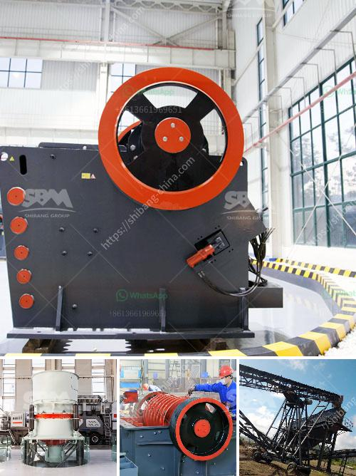

<h3>coal crushing machine in east rand</h3>
Coal is an essential resource for economic development, providing energy to power industries and homes. However, the process of obtaining coal involves mining and crushing it to make it suitable for use. Coal crushing machines are used to break the coal into smaller sizes for transportation and further processing. This article will discuss the coal crushing machine in East Rand, its benefits, and its role in the coal mining industry.

The coal crushing machine plays a crucial role in the coal mining industry. It allows the coal to be mined in an efficient and cost-effective manner. The crushing machine uses high-pressure compression to crush the coal into smaller sizes. This process allows for easy transportation and storage, saving both time and money.

In East Rand, the coal crushing machine is widely used due to its numerous benefits. One of the primary advantages of using this machine is its ability to increase the efficiency of the coal mining process. By breaking down the coal into smaller sizes, it becomes easier to handle and transport. This also reduces the risk of accidents and injuries associated with manual handling.

Another benefit of the coal crushing machine is its environmental impact. By crushing the coal into smaller sizes, it becomes easier to transport and burn efficiently. This leads to a lower carbon footprint and reduces the emission of greenhouse gases, contributing to a cleaner environment.

Furthermore, the coal crushing machine in East Rand is highly versatile. It can be used in various mining operations, regardless of the size and type of coal being mined. This flexibility allows companies to adapt their operations to changing market demands and optimize their production processes.

The East Rand coal crushing machine is also cost-effective. Compared to manual labor, which is both time-consuming and labor-intensive, using the crushing machine saves on labor costs. It requires fewer workers to operate, reducing the overall operational expenses.

In conclusion, the coal crushing machine in East Rand is an essential tool for the coal mining industry. Its ability to break down the coal into smaller sizes enhances the efficiency of the mining process while reducing environmental impact. Its versatility and cost-effectiveness make it a valuable asset for companies in the coal mining sector. By investing in high-quality coal crushing machines, mining companies can streamline their operations, increase productivity, and contribute to the sustainable development of the industry.
<h3>Contact us</h3><ul><li><strong>Whatsapp:&nbsp;<a href="https://wa.me/8613661969651">+8613661969651</a></strong></li><li><a href="https://swt.shibang-china.com/?git&amp;zhl&amp;coal crushing machine in east rand"><strong>Online Service(chat now)</strong></a></li></ul><h3>Related</h3><ul><li><a href='granite crushing process.md'>granite crushing process</a></li><li><a href='distributor crusher di indonesia.md'>distributor crusher di indonesia</a></li><li><a href='used cement plant for sale germany.md'>used cement plant for sale germany</a></li><li><a href='south africa jaw crushers.md'>south africa jaw crushers</a></li><li><a href='ultrafine grinding mill.md'>ultrafine grinding mill</a></li></ul>