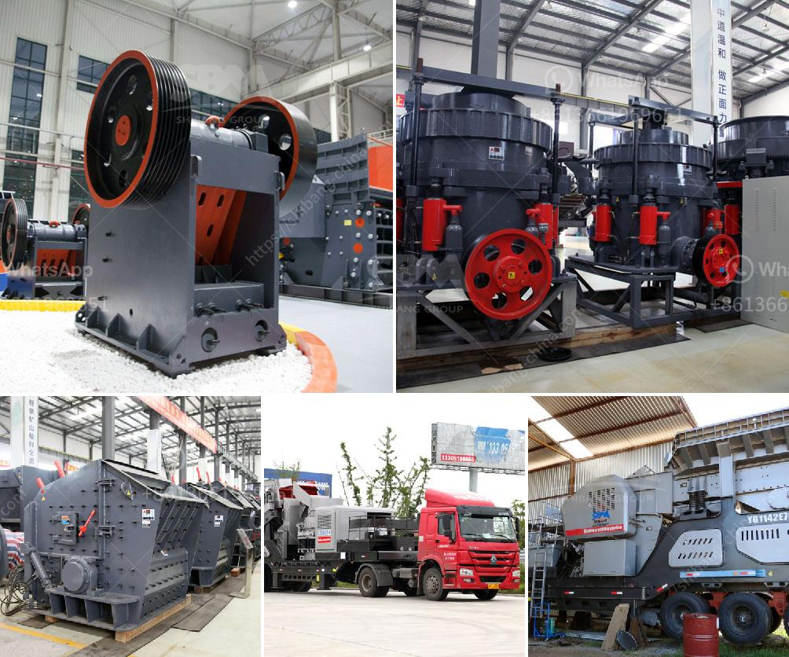

<h3>coal crushing plant in pakistan</h3>
Coal is the most abundant energy resource in Pakistan, with an estimated 185 billion tons of reserves. It plays a crucial role in the country's energy mix, contributing to around 38% of the total electricity generated. As the demand for electricity continues to rise, the need for efficient coal crushing plants in Pakistan is increasing. 

A coal crushing plant is used to break large coal chunks into smaller pieces, reducing them to the required size for different applications. The crushed coal pieces are often used in brick manufacturing, power plants, and cement production. To meet the needs of these industries, a reliable and productive crushing plant is essential.

Pakistan has made significant strides in the coal mining sector over the past few years. Many new coal mining projects have been initiated, and the existing facilities have been expanded. These developments have increased the demand for coal crushing plants in the country.

To efficiently crush coal, various types of crushing equipment are used, such as jaw crushers, impact crushers, cone crushers, and hammer crushers. Different crushers have different operating principles and produce different particle sizes. Choosing the right crusher for a specific coal processing operation is crucial to ensure high productivity and cost-effectiveness.

In addition to the crusher, other equipment such as vibrating screens, feeders, and conveyors are also essential components of coal crushing plants. These auxiliary equipment play a crucial role in ensuring the smooth operation of the plant and efficient processing of coal.

Coal crushing plants in Pakistan are becoming more and more important as the country looks to increase domestic coal production to reduce its reliance on imported coal. Currently, the majority of Pakistan's coal is imported from other countries such as Indonesia, South Africa, and Australia. By increasing domestic coal production and establishing more coal crushing plants, Pakistan can save foreign exchange and meet its energy needs more effectively.

In conclusion, the establishment of coal crushing plants in Pakistan is a stepping stone towards better utilization of the country's coal resources. By investing in advanced crushing technology, efficient equipment, and skilled workforce, Pakistan can improve its coal mining sector and meet the growing energy demand adequately.
<h3>Contact us</h3><ul><li><strong>Whatsapp:&nbsp;<a href="https://wa.me/8613661969651">+8613661969651</a></strong></li><li><a href="https://swt.shibang-china.com/?git&amp;zhl&amp;coal crushing plant in pakistan"><strong>Online Service(chat now)</strong></a></li></ul><h3>Related</h3><ul><li><a href='vibrating feeder suppliers in the philippines.md'>vibrating feeder suppliers in the philippines</a></li><li><a href='sell crusher of jaw in peru.md'>sell crusher of jaw in peru</a></li><li><a href='price of grinding mills in kenya.md'>price of grinding mills in kenya</a></li><li><a href='crushing plants for sale in sri lanka.md'>crushing plants for sale in sri lanka</a></li><li><a href='pebbel stone crusher.md'>pebbel stone crusher</a></li></ul>