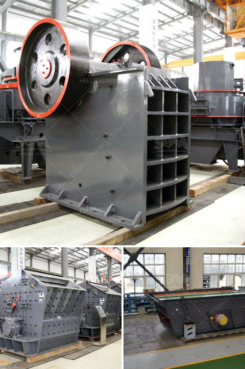

<h3>coal mill 250 ton</h3>
The coal mill is a vital piece of equipment in the coal-fired power plant. During the coal grinding process, the coal is crushed and its superficial area increases continually. To add new superficial area, the bond between solid molecules must be overcome, so the energy is consumed. The coal is grinded into pulverized coal in the coal mill mainly by means of three crushing styles, impacting, grinding, and squeezing.

The coal mill operates in an open circuit, with a ventilation system, providing continuous feedback to the mill controller to adjust pulverized coal fineness. The mill outlet temperature is maintained at a desirable value of around 70 degrees Celsius. The primary air flow to the furnace is fed through the mill, with a portion of it diverted into the coal mill inlet for drying and transporting the pulverized coal to the furnace.

A coal mill with a capacity of 250 tons is designed to handle a wide range of coals and coals that contain various sulfur contents. In addition, its capacity is influenced by factors such as coal grindability, moisture content, and coal fineness.

To facilitate the efficient combustion of coal and prevent the emission of harmful pollutants, the coal mill operates with a dynamic separator, which takes advantage of the differing densities of coal particles and air. The separator separates coarse coal particles from fine coal particles, which are then sent back to the mill for further grinding. The coarse coal particles are rejected and transported to the furnace for combustion.

The coal mill is equipped with a system for monitoring and controlling the temperature, pressure, and other operational parameters to ensure safe and efficient operation. An intelligent control system continuously analyzes and adjusts the mill performance based on real-time data, optimizing the grinding process and contributing to stable combustion conditions in the furnace.

With a coal mill capacity of 250 tons, the power plant can produce a significant amount of electricity. The pulverized coal, when burned in the furnace, releases heat energy, which is used to generate steam. The steam is then used to drive a turbine, producing electricity. The efficient operation of the coal mill is crucial for the overall performance of the power plant and its ability to generate power reliably and cost-effectively.

Although coal remains a widely used fuel for power generation due to its abundance and affordability, concerns about its impact on climate change and air pollution have resulted in increased efforts to reduce coal consumption and transition to cleaner energy sources. However, as long as coal-fired power plants continue to operate, the coal mill remains a critical component in ensuring efficient and sustainable power generation.

In conclusion, the coal mill with a capacity of 250 tons plays a crucial role in the coal-fired power plant. Its operation and performance directly influence the overall efficiency and reliability of the power plant. As the world moves towards cleaner energy sources, the importance of optimizing and improving coal mill performance cannot be overstated. It is essential to continue investing in research and development of advanced technologies to minimize the environmental impact of coal-fired power generation while meeting the growing energy demands of society.
<h3>Contact us</h3><ul><li><strong>Whatsapp:&nbsp;<a href="https://wa.me/8613661969651">+8613661969651</a></strong></li><li><a href="https://swt.shibang-china.com/?git&amp;zhl&amp;coal mill 250 ton"><strong>Online Service(chat now)</strong></a></li></ul><h3>Related</h3><ul><li><a href='magnetic separator distributor in surabaya.md'>magnetic separator distributor in surabaya</a></li><li><a href='stone crushing plant for sale in pakistan.md'>stone crushing plant for sale in pakistan</a></li><li><a href='iron ore mobile crusher.md'>iron ore mobile crusher</a></li><li><a href='calcium carbonate grinding industries in india.md'>calcium carbonate grinding industries in india</a></li><li><a href='industrial vibrator feeders.md'>industrial vibrator feeders</a></li></ul>