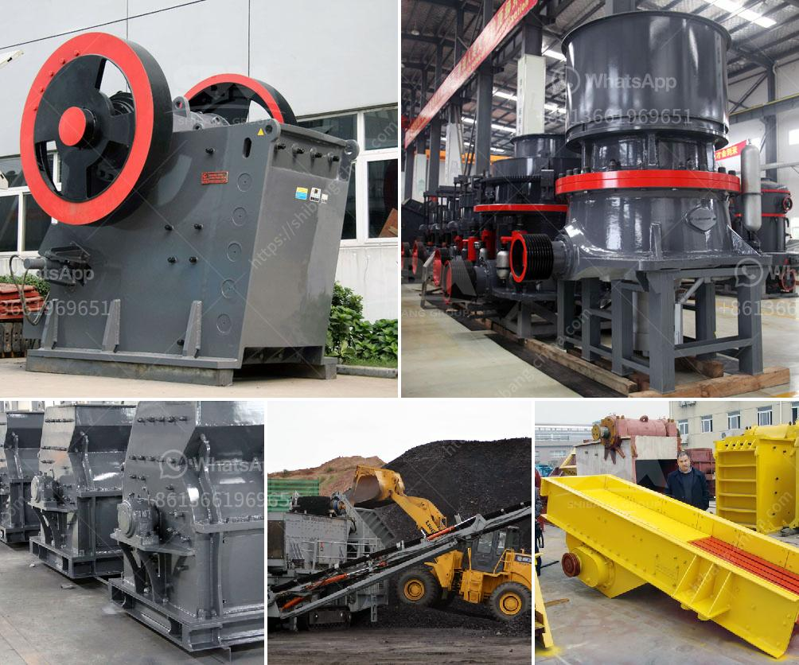

<h3>coal mill manufacturer china</h3>
Coal, an essential fuel for power generation, is widely used across the globe. China, as the world's largest coal producer and consumer, has abundant reserves of this fossil fuel. As a result, there is a high demand for coal mill manufacturers in China. With the country experiencing a significant growth in coal power generation capacity, the market for coal mill manufacturers is booming.

The coal mill manufacturers in China range from small private enterprises to big state-owned enterprises and multinational corporations. These mills are widely used in thermal power plants, cement plants, and other industries where coal is used as fuel to generate electricity. The grinding process of coal in these mills involves many variables, such as the physical properties of coal, the feeding rate, the grinding speed, and the grinding media. Therefore, it requires highly efficient and reliable coal mill manufacturers to meet the increasing demand.

One of the leading coal mill manufacturers in China is Shanghai Shibang Machinery Co., Ltd., which has been engaging in this field for decades. Through continuous research and development, their coal mill machines have been highly praised by the customers. The SBM coal mills are characterized by high grinding efficiency, low power consumption, easy maintenance, and long service life. This has helped the company gain a strong reputation both domestically and internationally.

Another prominent coal mill manufacturer in China is Northern Heavy Industries Group Co., Ltd. (NHI), a mining machinery supplier headquartered in Shenyang. Their coal mill equipment is customized to meet the needs of diverse coal grinding applications and is well-suited to processing coal with different moisture levels. NHI's coal mills have a stable performance, flexible operation, and easy maintenance. This has made them popular choices for coal-fired power plants and industrial furnaces across China.

China National Coal Mining Equipment Co., Ltd. (CME) is yet another leading coal mill manufacturer in China. CME's core business includes manufacturing and supplying comprehensive coal mining equipment, coal grinding equipment, and a range of other mining equipment. Their products are characterized by high quality, advanced technology, and long service life. CME's coal mills are widely used in coal-fired power plants and cement plants in China and have gained high praise for their excellent performance.

With China's commitment to reducing carbon emissions and transitioning towards cleaner energy sources, the future of coal usage may face challenges. However, for the time being, coal remains a vital energy source for the country. As a result, the demand for coal mill manufacturers in China is expected to remain strong. These manufacturers are continuously investing in research and development to improve the efficiency and environmental performance of their coal mill machines.

In conclusion, coal mill manufacturers in China play a significant role in meeting the demand for coal used in power generation. The country's abundant reserves and growing coal power generation capacity have created a robust market for these manufacturers. With their high-quality products, advanced technology, and strong customer support, Chinese coal mill manufacturers are well-positioned to serve the domestic and international markets for years to come.
<h3>Contact us</h3><ul><li><strong>Whatsapp:&nbsp;<a href="https://wa.me/8613661969651">+8613661969651</a></strong></li><li><a href="https://swt.shibang-china.com/?git&amp;zhl&amp;coal mill manufacturer china"><strong>Online Service(chat now)</strong></a></li></ul><h3>Related</h3><ul><li><a href='hammer mill south africa.md'>hammer mill south africa</a></li><li><a href='stone crusher uganda.md'>stone crusher uganda</a></li><li><a href='ball mill how to grind mineral.md'>ball mill how to grind mineral</a></li><li><a href='rollers for stone ball mills.md'>rollers for stone ball mills</a></li><li><a href='cement crusher machines price in india.md'>cement crusher machines price in india</a></li></ul>