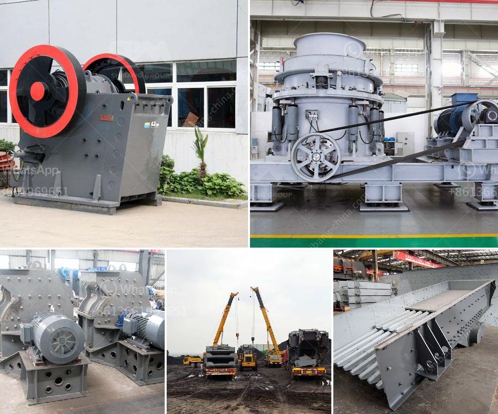

<h3>coal mill reject conveying system</h3>
Coal mill reject conveying system is a process that moves coal mill rejects away from the mill to the hopper or belt conveyor system. It can effectively streamline the disposal of coal mill rejects and ensure their safe and secure handling.

In a coal-fired power plant, the coal pulverizer is critical for fuel processing. It is important to operate the coal mill properly to maximize its efficiency and avoid unwanted shutdowns. Coal mill rejects are a byproduct of the coal pulverization process, where the crushed coal particles are separated from the coal mill in a cyclone separator or bag filter.

One challenge in managing coal mill rejects is the unwanted accumulation of these rejects in the mill area, often leading to equipment damage and fires. The accumulation of rejects can result in decreased pulverizer performance and increased maintenance costs. To prevent these issues, a coal mill reject conveying system is employed to transport the rejects from the mill area to a designated storage or disposal area.

The coal mill reject conveying system consists of a grinding mill, an ash hopper, a pneumatic conveying system, and a bag filter. Grinding mills grind the coal into fine particles, and the ash hopper collects the rejects from the mill. The pneumatic conveying system transports the rejects to a designated silo or bunker, where they can be further processed or disposed of.

By employing a coal mill reject conveying system, power plants can effectively manage their coal mill rejects and prevent unnecessary downtime. This system ensures the safe disposal of mill rejects and reduces the risk of equipment damage and fire incidents. Additionally, it helps maintain the efficiency and performance of the coal pulverizer, ensuring continuous and smooth power generation.

In conclusion, a coal mill reject conveying system plays a crucial role in the efficient and safe operation of coal-fired power plants. It effectively handles coal mill rejects and prevents them from accumulating in the mill area, reducing maintenance costs and minimizing the risk of equipment damage and fire incidents. Power plants can benefit greatly from implementing such a system to streamline their coal mill reject management process.
<h3>Contact us</h3><ul><li><strong>Whatsapp:&nbsp;<a href="https://wa.me/8613661969651">+8613661969651</a></strong></li><li><a href="https://swt.shibang-china.com/?git&amp;zhl&amp;coal mill reject conveying system"><strong>Online Service(chat now)</strong></a></li></ul><h3>Related</h3><ul><li><a href='cost for the ball mill machines.md'>cost for the ball mill machines</a></li><li><a href='hammer mill equipment south africa price.md'>hammer mill equipment south africa price</a></li><li><a href='types of coal crusher used in industry.md'>types of coal crusher used in industry</a></li><li><a href='manufacturer of quartz powder in india.md'>manufacturer of quartz powder in india</a></li><li><a href='barite mining equipment.md'>barite mining equipment</a></li></ul>