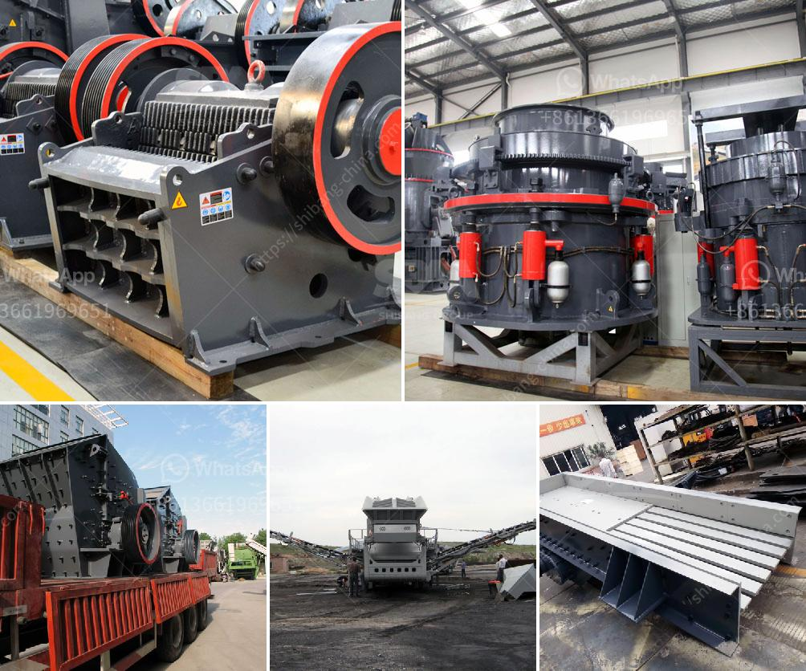

<h3>coal mining equipment for sale</h3>
Coal mining equipment for sale is extensive and constantly expanding. Whether you need underground or surface mining equipment, or both, there is a vast selection of available options for you to choose from. Underground coal mining equipment includes scoops, shuttle cars, continuous miners, longwall miners, and roof bolters. Surface coal mining equipment includes draglines, loaders, bulldozers, and haul trucks. Each piece of equipment offers unique advantages and plays a crucial role in the mining process.

One of the most popular underground coal mining equipment is the continuous miner. This machine is capable of cutting, loading, and hauling coal at an impressive rate. The continuous miner utilizes a large rotating drum with carbide-tipped teeth to effectively mine the coal. This piece of equipment is designed to maneuver through narrow mine passages and efficiently extract coal while minimizing waste.

Another essential piece of equipment for underground coal mining is the shuttle car. This vehicle is responsible for transporting the coal from the continuous miner to the conveyor or other loading points. The shuttle car is designed to traverse rugged terrain and transport a significant amount of coal quickly and safely.

Surface coal mining equipment is equally as crucial for large-scale operations. Draglines, for example, are massive machines used to strip away overburden and uncover valuable coal seams. These machines boast impressive digging capabilities and can remove large volumes of material efficiently.

Loaders and bulldozers are also commonly used in surface coal mining. Loaders scoop up coal and load it into trucks for transportation, while bulldozers are ideal for pushing and stacking coal piles.

Haul trucks are an integral component of surface coal mining equipment as they carry large loads of coal from the mining area to the processing plant or other designated transport points.

Overall, the coal mining equipment market offers a diverse range of options catering to the needs of both underground and surface coal mining operations. The equipment is designed to efficiently extract coal while ensuring the safety of miners and maximizing productivity. Whether you are expanding your existing coal mining operation or starting a new one, there is a wide range of equipment available for sale to meet your specific requirements.
<h3>Contact us</h3><ul><li><strong>Whatsapp:&nbsp;<a href="https://wa.me/8613661969651">+8613661969651</a></strong></li><li><a href="https://swt.shibang-china.com/?git&amp;zhl&amp;coal mining equipment for sale"><strong>Online Service(chat now)</strong></a></li></ul><h3>Related</h3><ul><li><a href='industrial micronized powder grinding mill.md'>industrial micronized powder grinding mill</a></li><li><a href='chromium ore mining equipmentr.md'>chromium ore mining equipmentr</a></li><li><a href='crawler portable crusher.md'>crawler portable crusher</a></li><li><a href='quarrying crusher equipment.md'>quarrying crusher equipment</a></li><li><a href='chrome ore processing plant price.md'>chrome ore processing plant price</a></li></ul>