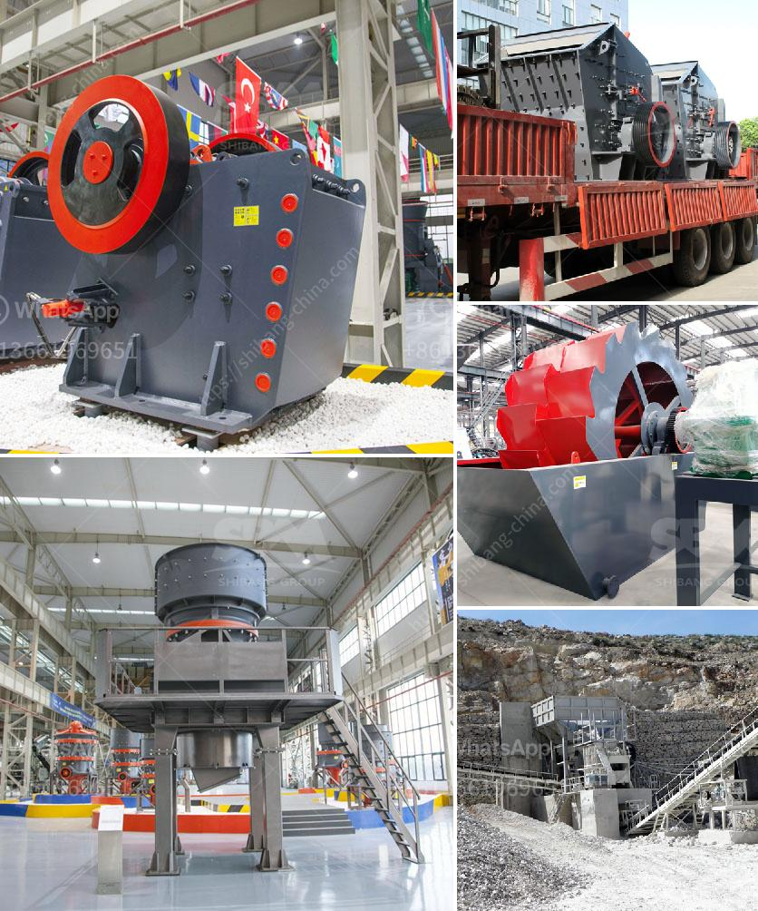

<h3>coal mining process machinery</h3>
Coal mining is the process of extracting coal from the ground. Coal is valued for its energy content and has been widely used for electricity generation and industrial purposes, such as refining metals. Coal is extracted from the earth through underground mining or open-pit mining.

The coal mining process involves the use of various machinery, depending on the depth of the coal seam and the terrain. The equipment used for coal mining can be categorized into two types: the machines used for surface mining and those used for underground mining.

Surface mining is used when coal deposits are found close to the surface. It involves removing the soil and rock covering the coal, known as overburden, to access the coal seam. The machinery used for surface mining includes bulldozers, excavators, and haul trucks. These machines remove the overburden and extract and transport the coal to the processing plant or to the train or truck for transportation to a power plant.

Bulldozers are used to remove vegetation, rocks, and soil to expose the coal seam. They are equipped with large blades at the front to push the material aside. Excavators are used to dig the coal and load it onto the haul trucks. These machines have a bucket at the front that can be maneuvered to collect the coal and place it into the truck for transportation.

Haul trucks are used to transport the coal from the mining site to the processing plant or the designated area for transportation. These trucks are specially designed to carry heavy loads, with capacities ranging from 100 to 400 tons. They are equipped with large wheels and powerful engines to navigate through rough terrains and transport coal efficiently.

In underground mining, coal is extracted by tunneling into the earth to access the coal seam. The machinery used for underground mining includes continuous miners, shuttle cars, and roof bolters.

Continuous miners are used to excavate the coal and remove it from the mine face. These machines have a rotating drum with teeth that cut into the coal and break it into smaller pieces. The coal is then loaded onto shuttle cars, which transport it to the conveyor belt for removal from the mine.

Roof bolters are used to reinforce the roof of the mine to ensure the safety of the workers and the stability of the mine. These machines drill holes into the roof and insert bolts to secure it, preventing it from collapsing.

In addition to these primary machinery, coal mining also requires support equipment such as maintenance vehicles and ventilation systems to ensure the safety and efficiency of the operation.

In conclusion, the coal mining process involves the use of machinery to extract the coal from the earth and transport it to the processing plant or designated area for transportation. It includes both surface mining and underground mining, with different types of machinery used depending on the depth of the coal seam and the terrain. The machinery used for coal mining plays a crucial role in improving productivity and efficiency in coal mining operations.
<h3>Contact us</h3><ul><li><strong>Whatsapp:&nbsp;<a href="https://wa.me/8613661969651">+8613661969651</a></strong></li><li><a href="https://swt.shibang-china.com/?git&amp;zhl&amp;coal mining process machinery"><strong>Online Service(chat now)</strong></a></li></ul><h3>Related</h3><ul><li><a href='best stone crushers india.md'>best stone crushers india</a></li><li><a href='feldspar powder suppliers.md'>feldspar powder suppliers</a></li><li><a href='pe 400 jaw crusher.md'>pe 400 jaw crusher</a></li><li><a href='how to find startup funding for a stone crushing business.md'>how to find startup funding for a stone crushing business</a></li><li><a href='stone crusher plant project report.md'>stone crusher plant project report</a></li></ul>