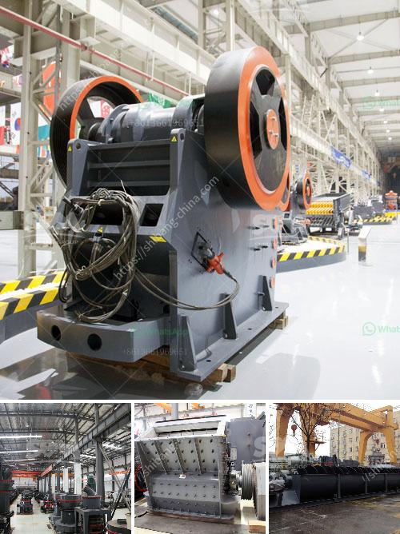

<h3>coal processing plant in philippines</h3>
Coal has been a predominant source of energy in the Philippines for decades. However, as the country looks to diversify its energy mix and reduce its dependence on coal, the development of clean and sustainable energy sources has become a top priority. In line with this, the government has been actively promoting the establishment of coal processing plants in the country to support the growing demand for cleaner energy.

A coal processing plant, also known as a coal beneficiation plant, is a facility that washes coal of soil and rock, crushes it into graded sizes, and separates impurities to produce clean, saleable coal for energy production. The Philippines has significant reserves of coal, which can be utilized for power generation, but its high ash content and sulfur content make it less environmentally friendly compared to other available fuel options.

The establishment of a coal processing plant in the Philippines allows the local production of clean coal, thus reducing the country's reliance on imported coal. This not only helps improve energy security but also contributes to the nation's economic growth and job creation. The plant can also play a crucial role in reducing pollution and greenhouse gas emissions by implementing advanced technologies for coal washing and emissions control.

One of the challenges in coal processing is the efficient removal of impurities and contaminants from the coal. These impurities can include rocks, soil, sulfur, and other minerals that reduce the energy content and quality of the coal. To address this issue, advanced coal washing technologies can be employed. These technologies use physical separation processes such as gravity separation, flotation, and magnetic separation to remove impurities and produce clean coal with desirable properties.

Another important aspect of coal processing plants is the implementation of emission control systems. Coal combustion produces emissions such as sulfur dioxide, nitrogen oxides, and particulate matter, which contribute to air pollution and respiratory illnesses. To mitigate these emissions, coal processing plants can employ scrubbers, filters, and other air pollution control technologies. These systems help remove harmful pollutants from the flue gas before it is released into the atmosphere.

Furthermore, the employment opportunities provided by a coal processing plant in the Philippines can contribute to poverty reduction and socio-economic development. The plant can create jobs in various sectors such as construction, operation, maintenance, and management. It can also stimulate the growth of supporting industries such as transportation, logistics, and engineering services. Additionally, the establishment of a coal processing plant can attract investments and drive local economic activities.

While the development of coal processing plants in the Philippines offers several benefits, it is essential to ensure that these plants adhere to stringent environmental regulations and standards. Measures should be in place to monitor and mitigate the potential environmental impacts associated with coal processing, such as land degradation, water pollution, and deforestation. Stringent regulation and regular monitoring can help minimize these impacts and ensure the sustainable growth of the coal processing industry in the Philippines.

In conclusion, the establishment of coal processing plants in the Philippines can support the country's transition towards cleaner and more sustainable energy sources. These plants can contribute to energy security, economic growth, job creation, and pollution reduction. However, it is crucial to implement advanced technologies and stringent environmental regulations to ensure that the coal processing industry operates in a sustainable and responsible manner.
<h3>Contact us</h3><ul><li><strong>Whatsapp:&nbsp;<a href="https://wa.me/8613661969651">+8613661969651</a></strong></li><li><a href="https://swt.shibang-china.com/?git&amp;zhl&amp;coal processing plant in philippines"><strong>Online Service(chat now)</strong></a></li></ul><h3>Related</h3><ul><li><a href='machinery required for marble quarry crusher.md'>machinery required for marble quarry crusher</a></li><li><a href='gypsum recycling plant.md'>gypsum recycling plant</a></li><li><a href='gold processing mill for sale.md'>gold processing mill for sale</a></li><li><a href='rock crusher equipment.md'>rock crusher equipment</a></li><li><a href='complete mobile stone crushing machine.md'>complete mobile stone crushing machine</a></li></ul>