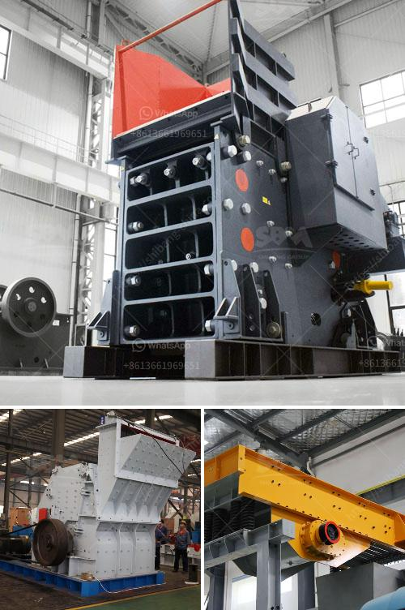

<h3>coal pulverisers machines</h3>
Coal has been used as a primary source of energy for centuries. Its abundant supply and relatively low cost make it a popular choice for power generation. However, before it can be used in power plants, coal needs to undergo a series of processes to be converted into a usable form. One crucial step in this process is the pulverization of coal into fine particles, which is where coal pulverizers machines come into play.

A coal pulverizer is a mechanical device used to grind and crush coal into small particles for combustion purposes. These machines play a vital role in the energy generation process by turning coal into a powder-like substance that can be easily burned in a furnace. They are an integral part of coal-fired power plants, ensuring the efficient and reliable conversion of coal into heat energy.

The main function of coal pulverizers is to crush the raw coal and grind it to a specific size, typically ranging from 70 to 100 mesh (200 microns). This finely ground coal is then transported to the burners through the coal pipes, where it is mixed with combustion air and ignited. The combustion process releases heat energy, which is used to generate steam and drive turbines to produce electricity.

Coal pulverizers machines are designed to operate in harsh conditions, continuously grinding coal and handling high temperatures and pressures. They are equipped with durable grinding elements and rugged construction to withstand the demanding nature of coal combustion. Additionally, modern pulverizers are equipped with advanced technology and control systems to optimize performance, minimize emissions, and improve overall efficiency.

The size and capacity of coal pulverizers machines vary depending on the power plant's requirements. They can range from small units used in industrial applications to large-scale machines capable of processing tons of coal per hour. Some pulverizers are standalone units, while others are integrated into a complete coal preparation system, including coal feeders, classifiers, and ash handling equipment.

In conclusion, coal pulverizers machines are essential tools in the energy generation process. They play a critical role in converting raw coal into a fine powder that can be efficiently burned to produce heat energy. With their robust construction, advanced technology, and reliable performance, these machines ensure the effective utilization of coal as a primary source of power worldwide.
<h3>Contact us</h3><ul><li><strong>Whatsapp:&nbsp;<a href="https://wa.me/8613661969651">+8613661969651</a></strong></li><li><a href="https://swt.shibang-china.com/?git&amp;zhl&amp;coal pulverisers machines"><strong>Online Service(chat now)</strong></a></li></ul><h3>Related</h3><ul><li><a href='hard stone crush maker pakistan.md'>hard stone crush maker pakistan</a></li><li><a href='3 mesh vibrating screen.md'>3 mesh vibrating screen</a></li><li><a href='vertical grinding machine.md'>vertical grinding machine</a></li><li><a href='stone crusher uganda.md'>stone crusher uganda</a></li><li><a href='coal mining equipment for sale.md'>coal mining equipment for sale</a></li></ul>