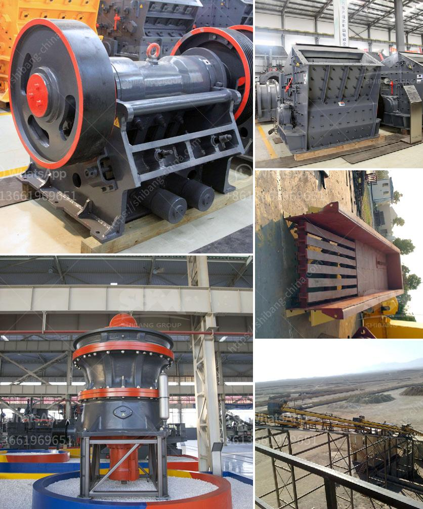

<h3>coal pulverizer price</h3>
Coal pulverizers play a vital role in the energy industry by efficiently transforming coal into fine powder for combustion in power plants. However, the price of coal pulverizers is an important consideration for both potential buyers and manufacturers. This article aims to delve into the factors impacting the price of coal pulverizers and the significance of this machinery in the energy sector.

Coal pulverizers are industrial machines used to grind coal into small granules, enabling better combustion efficiency and heat generation in power plants. These pulverizers are designed to crush coal into fine particles, enhancing the overall performance of coal-fired boilers. As an integral part of power generation, coal pulverizers contribute to the reliable and efficient production of electricity.

The technological advancements and design features incorporated into coal pulverizers greatly influence their prices. Innovative engineering, such as improved grinding capacity, enhanced combustion efficiency, and reduced emissions, often comes at a higher cost. Cutting-edge designs and state-of-the-art technology usually entail a premium price tag.

The cost of materials used in constructing coal pulverizers significantly affects their prices. High-quality materials that ensure durability and longevity, such as heat-resistant alloy steels, increase production costs. Additionally, the complexity of the manufacturing process, including precision machining and assembly, can influence the final pricing.

Coal pulverizer prices vary depending on their size and capacity. Larger and high-capacity pulverizers capable of processing larger coal quantities generally command higher prices due to the increased complexity and materials required. Smaller and lower-capacity pulverizers, on the other hand, tend to be more affordable but may have limited efficiency and output.

The ongoing maintenance and operational costs associated with coal pulverizers can indirectly impact their prices. Pulverizers that require minimal maintenance, have longer service intervals, or result in lower energy consumption generally have a higher price initially but offer cost savings in the long run. Considering the overall lifecycle costs can provide a clearer understanding of the value proposition of different coal pulverizers.

Coal pulverizers are crucial for ensuring the efficient and clean combustion of coal, thereby reducing emissions and improving environmental impact. They enable power plants to meet strict regulatory standards, enhancing air quality and ultimately contributing to a sustainable energy future. Therefore, investing in reliable and advanced coal pulverizers is essential to maintain a consistent and affordable supply of electricity while minimizing environmental harm.

The price of coal pulverizers is influenced by a combination of factors, including technology, manufacturing costs, size, capacity, and maintenance requirements. Balancing these factors is crucial in providing efficient and cost-effective solutions for the energy industry. Coal pulverizers play a vital role in power generation, allowing us to harness the energy potential of coal while minimizing its environmental impact. Therefore, careful consideration of the price, while also examining performance, efficiency, and environmental considerations, is essential when selecting coal pulverizers.
<h3>Contact us</h3><ul><li><strong>Whatsapp:&nbsp;<a href="https://wa.me/8613661969651">+8613661969651</a></strong></li><li><a href="https://swt.shibang-china.com/?git&amp;zhl&amp;coal pulverizer price"><strong>Online Service(chat now)</strong></a></li></ul><h3>Related</h3><ul><li><a href='limestone crushing mill.md'>limestone crushing mill</a></li><li><a href='bentonite crusher grinding mill mobile.md'>bentonite crusher grinding mill mobile</a></li><li><a href='sand washing machines for crusher nepal.md'>sand washing machines for crusher nepal</a></li><li><a href='price for china crusher.md'>price for china crusher</a></li><li><a href='discovery of copper and cobalt in zambia.md'>discovery of copper and cobalt in zambia</a></li></ul>