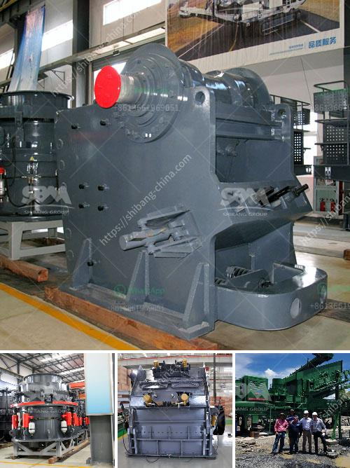

<h3>coal pulverizer types</h3>
Coal pulverizers play a vital role in the efficiency and functionality of a coal-fired power plant. The main function of a pulverizer is to break coal into fine particles for combustion in the furnace. The pulverizer is an essential component in the process of generating thermal energy, enabling coal to be used as a fuel.

There are several types of coal pulverizers, which are categorized based on the speed at which the grinding process occurs. Low speed pulverizers include ball tube mills and ring and ball mills, while high-speed pulverizers include attrition mills and hammer mills.

Ball Tube Mills: The ball tube mill is a cylindrical low-speed grinding mill. It consists of a steel barrel, lined with cast alloy plates, with openings in the bottom and top covers. The coal is fed into the rotating barrel through a central inlet pipe. As the barrel rotates, the grinding media (steel balls or rods) crush the coal into small particles. These particles are then carried out of the mill by the air flow, and are separated in a classifier located at the top of the mill. The pulverized coal is then conveyed to the furnace for combustion.

Ring and Ball Mills: This type of mill consists of two types of rings separated by a series of large balls. The lower ring rotates, while the upper ring remains stationary. As coal is fed into the mill, it gets crushed between the balls and the grinding ring. The crushed coal is then transported to the furnace for combustion.

Attrition Mills: An attrition mill is a high-speed pulverizer that consists of a rotating disc. The coal is fed into the disc at the center, where it is crushed by the rotating pins. The crushed coal then flows through a classifier, which separates the coal particles based on size. The pulverized coal is collected in a hopper and is conveyed to the furnace for combustion.

Hammer Mills: A hammer mill is a high-speed pulverizer that consists of a horizontal rotating shaft with hammers mounted on it. As the shaft rotates, the hammers crush the coal against a grinding plate. The crushed coal then flows through a screen where it is sorted based on particle size and conveyed to the furnace for combustion.

Each type of coal pulverizer has its own unique advantages and disadvantages. For example, ball tube mills are reliable and efficient but require high maintenance and are sensitive to coal quality variations. On the other hand, attrition mills are easy to operate and maintain but may result in a higher percentage of unburned coal.

In conclusion, coal pulverizers are critical components in a coal-fired power plant. They reduce coal to fine particles, enabling effective combustion in the furnace. The various types of pulverizers, including ball tube mills, ring and ball mills, attrition mills, and hammer mills, offer different benefits and drawbacks. The choice of pulverizer type depends on factors such as coal quality, required fineness, and maintenance requirements.
<h3>Contact us</h3><ul><li><strong>Whatsapp:&nbsp;<a href="https://wa.me/8613661969651">+8613661969651</a></strong></li><li><a href="https://swt.shibang-china.com/?git&amp;zhl&amp;coal pulverizer types"><strong>Online Service(chat now)</strong></a></li></ul><h3>Related</h3><ul><li><a href='crusher machine for unit.md'>crusher machine for unit</a></li><li><a href='dolomite crusher plant in kuwait.md'>dolomite crusher plant in kuwait</a></li><li><a href='used limestone crushing equipment houston.md'>used limestone crushing equipment houston</a></li><li><a href='stone crusher output per hour india.md'>stone crusher output per hour india</a></li><li><a href='cost for the ball mill machines.md'>cost for the ball mill machines</a></li></ul>