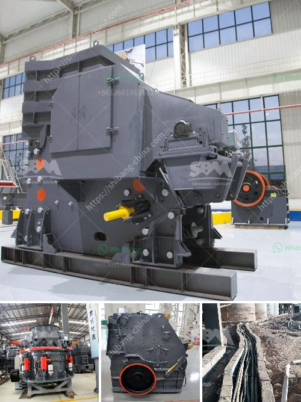

<h3>coal washing plant for sale grinding mill china</h3>
Coal washing plant for sale Grinding Mill China is the most cost-effective method for coal preparation and processing in today's economic environment. A coal washing plant can be utilized to beneficiate a wide range of coals and can be easily adjusted to accommodate various coal types. They provide a way to remove impurities, such as ash and sulfur, while increasing the coal's calorific value.

In recent years, environmental concerns have led to increased regulations regarding coal-fired power plants. These regulations have made coal washing plants an essential part of the coal industry. By removing impurities, coal washing plants help reduce emissions and improve the overall quality of the coal produced.

China, being the world's largest coal producer and consumer, has a high demand for coal washing plants. As a result, there is a growing market for coal washing plant equipment suppliers. Grinding Mill China has become one of the leading suppliers of coal washing plants, offering a range of coal washing solutions to meet the specific needs of each customer.

The coal washing plant for sale from Grinding Mill China is designed to remove impurities from coal while maximizing its calorific value. With its high-capacity processing capability, the plant can handle a wide range of coals, ensuring excellent performance regardless of variations in coal quality.

The coal washing plant offered by Grinding Mill China is equipped with state-of-the-art technology, including dense medium cyclones, spirals, and advanced gravity separation equipment. These technologies ensure efficient coal washing and allow the plant to produce high-quality coal products.

Additionally, the coal washing plant for sale from Grinding Mill China is built with sustainability in mind. The plant is designed to minimize water usage, reduce energy consumption, and mitigate environmental impacts. This makes it an environmentally friendly choice for coal washing.

In conclusion, a coal washing plant for sale from Grinding Mill China is a cost-effective and environmentally friendly solution for coal preparation and processing. With its range of advanced technologies and high-capacity processing capabilities, it offers efficient coal washing and ensures high-quality coal products. As China's coal industry continues to grow, coal washing plants will play a crucial role in meeting environmental regulations and improving the overall efficiency of coal utilization.
<h3>Contact us</h3><ul><li><strong>Whatsapp:&nbsp;<a href="https://wa.me/8613661969651">+8613661969651</a></strong></li><li><a href="https://swt.shibang-china.com/?git&amp;zhl&amp;coal washing plant for sale grinding mill china"><strong>Online Service(chat now)</strong></a></li></ul><h3>Related</h3><ul><li><a href='mill to pulverize stone crusher.md'>mill to pulverize stone crusher</a></li><li><a href='crawler type mobile crushers.md'>crawler type mobile crushers</a></li><li><a href='crusher plant dolomite.md'>crusher plant dolomite</a></li><li><a href='100tph stone crushing and screening plant.md'>100tph stone crushing and screening plant</a></li><li><a href='ballast crushers alibaba.md'>ballast crushers alibaba</a></li></ul>