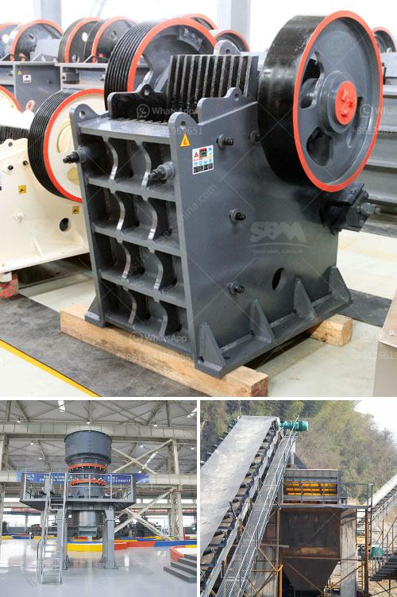

<h3>coal washing process machine price</h3>
The coal washing process machine is a vital component in coal preparation. It is used to remove impurities such as sulfur, ash, and rock from coal, enabling it to be used in power plants and other industrial applications. A well-functioning coal washing process machine ensures a consistent quality and composition of coal, resulting in improved efficiency and reduced environmental impact.

There are several factors that determine the price of a coal washing process machine. The first factor is the size or capacity of the machine. Machines with larger capacities can handle more coal and are typically priced higher than smaller machines. The size of the machine is determined by the amount of coal that needs to be processed and the desired output.

Another factor that influences the price is the level of automation and technology incorporated in the machine. More advanced machines with automated controls and digital monitoring systems tend to have higher prices. These machines offer increased efficiency, productivity, and safety, making them a preferable choice for many coal processing operations.

The quality, durability, and reliability of the machine also play a significant role in determining its price. Machines made from high-quality materials and components, backed by a reputable manufacturer, often come with a higher price tag. However, investing in a reliable and durable machine can result in long-term cost savings and operational efficiency.

Additionally, the availability and accessibility of spare parts and maintenance services can affect the price of a coal washing process machine. Machines with readily available spare parts and a reliable service network may be more expensive upfront but can save time and money in the long run. It is important to consider the maintenance requirements and associated costs when evaluating the price of a machine.

The market demand and competition among manufacturers also impact the pricing of coal washing process machines. A higher demand for these machines can drive up the price, especially when there are limited suppliers or manufacturers in the market. Conversely, a competitive market with multiple manufacturers can result in more affordable machines as manufacturers strive to offer competitive prices to attract customers.

In conclusion, the price of a coal washing process machine is influenced by various factors including its size, level of automation, quality, and market dynamics. Selecting the right machine involves considering the specific requirements of the coal processing operation, desired output, and long-term cost-effectiveness. It is crucial to conduct thorough research, compare different machines, and consult with experts to make an informed decision. Investing in a reliable and efficient coal washing process machine is essential for optimizing the coal preparation process and ensuring the quality of the end product.
<h3>Contact us</h3><ul><li><strong>Whatsapp:&nbsp;<a href="https://wa.me/8613661969651">+8613661969651</a></strong></li><li><a href="https://swt.shibang-china.com/?git&amp;zhl&amp;coal washing process machine price"><strong>Online Service(chat now)</strong></a></li></ul><h3>Related</h3><ul><li><a href='20 tph ball mills price.md'>20 tph ball mills price</a></li><li><a href='qurry crusher plant capacity.md'>qurry crusher plant capacity</a></li><li><a href='magnetic separator distributor in surabaya.md'>magnetic separator distributor in surabaya</a></li><li><a href='high efficiency manganese ore raymond mill in india.md'>high efficiency manganese ore raymond mill in india</a></li><li><a href='puzzolana crushers coimbatore.md'>puzzolana crushers coimbatore</a></li></ul>