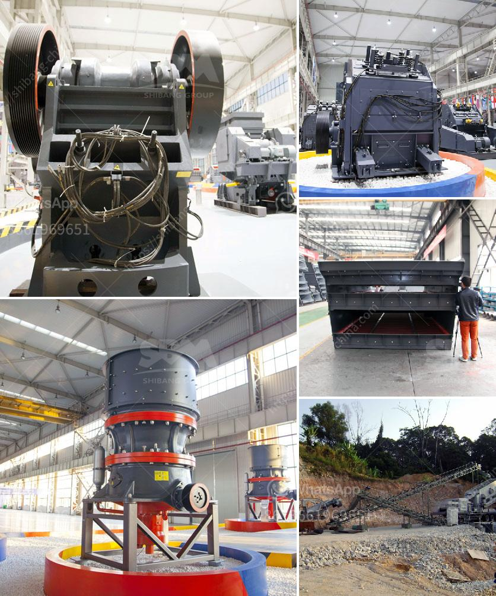

<h3>cobble stone project in ethiopia</h3>
In recent years, Ethiopia has witnessed a remarkable transformation in its infrastructure development, notably through the Cobble Stone Project. Under this initiative, the Ethiopian government has undertaken a large-scale effort to pave roads using ethically-sourced cobblestones. This article will delve into the details of the Cobble Stone Project and shed light on its impact on Ethiopia's economy, environment, and local communities.

The Cobble Stone Project was launched in 2006 as part of Ethiopia's strategic plan to improve its infrastructure while providing employment opportunities for local communities. The project involves mining, manufacturing, and laying cobblestones on roads across the country. Cobblestones are small, smooth stones used to pave surfaces and create durable and sustainable road networks.

The Cobble Stone Project has significantly contributed to Ethiopia's economic growth. By creating job opportunities for local communities, the project has boosted income levels and facilitated poverty reduction. This employment generation has directly improved the living conditions of thousands of Ethiopian households, providing them with a reliable source of income and economic security.

The project has also benefited small business owners involved in the production and supply chain of cobblestones. Local entrepreneurs, such as stone cutters, polishers, and transporters, have witnessed increased demand for their services, resulting in increased revenue and entrepreneurship opportunities. Moreover, the project has bolstered Ethiopia's construction industry by providing a reliable and affordable source of construction material.

Ethiopia's Cobble Stone Project aligns with the global agenda on environmental sustainability. By relying on ethically-sourced cobblestones, the initiative promotes responsible mining practices, minimizes environmental degradation, and reduces carbon emissions. The project significantly diminishes the reliance on asphalt, a non-renewable resource, while simultaneously enhancing the durability and longevity of the road infrastructure. The use of cobblestones also enables efficient rainwater drainage, thereby reducing the risk of floods and soil erosion.

The Cobble Stone Project has had a profound social impact within Ethiopian communities. By providing employment opportunities, the project has enhanced social inclusivity and gender equality, as it has enabled both men and women to participate in the construction sector. This has empowered women and increased their economic independence, consequently supporting women's empowerment initiatives in Ethiopia.

Furthermore, the improved road infrastructure has facilitated better access to healthcare, education, and markets for rural communities. It has increased mobility, reduced transportation costs, and enhanced connectivity, enabling farmers to sell their products in urban markets more efficiently. Additionally, the project has enhanced accessibility to healthcare facilities, enabling medical personnel to reach remote areas easily.

The Cobble Stone Project has been a catalyst for development in Ethiopia, effectively improving the country's road infrastructure, spurring economic growth, contributing to environmental sustainability, and empowering local communities. This initiative demonstrates a successful model for sustainable development, one that other countries can look to for inspiration. With the Cobble Stone Project, Ethiopia has paved the way for progress, creating a solid foundation for a prosperous future.
<h3>Contact us</h3><ul><li><strong>Whatsapp:&nbsp;<a href="https://wa.me/8613661969651">+8613661969651</a></strong></li><li><a href="https://swt.shibang-china.com/?git&amp;zhl&amp;cobble stone project in ethiopia"><strong>Online Service(chat now)</strong></a></li></ul><h3>Related</h3><ul><li><a href='used crusher price in uk.md'>used crusher price in uk</a></li><li><a href='cost of stone crushing plant.md'>cost of stone crushing plant</a></li><li><a href='machine de lavage a lattrition du sable de silice.md'>machine de lavage a lattrition du sable de silice</a></li><li><a href='turkey crusher company.md'>turkey crusher company</a></li><li><a href='crusher machine for unit.md'>crusher machine for unit</a></li></ul>