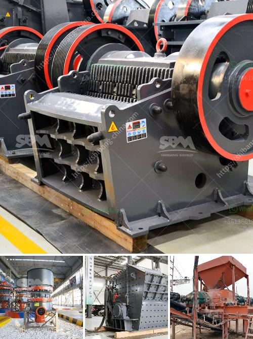

<h3>coconut shell powder mill machinery maker in sri lanka</h3>
Sri Lanka, commonly known as the "Island of Coconuts," has been blessed with lush coconut plantations spanning across its coastline. This tropical paradise is renowned for its rich coconut resources, serving as the hub for various coconut-based products. Amongst these products, coconut shell powder holds a special place in the hearts of both locals and international markets. To cater to the escalating demand, numerous machinery makers have emerged, revolutionizing the production process. In this article, we explore the significance of coconut shell powder mill machinery makers in Sri Lanka.

Coconut shell powder, derived from the outer shell of the coconut, is a versatile and sustainable material widely used across various industries. From activated carbon production to the manufacturing of mosquito repellents and cosmetics, coconut shell powder has found its place in a multitude of applications. Its natural properties, including high carbon content and excellent adsorption capabilities, make it an attractive choice for both industrial and domestic purposes.

The emergence of coconut shell powder mill machinery makers in Sri Lanka has transformed the traditional process of manually extracting the powder from the shell. This labor-intensive method was not only time-consuming but also possessed limitations in terms of production capacity and overall quality. With the introduction of modern technology and machinery, manufacturers can now streamline the entire process, yielding higher quantities without compromising on quality.

These machinery makers utilize cutting-edge technology to achieve efficient production, ensuring a consistent supply of coconut shell powder. Among the notable innovations is the coconut shell powder mill, which employs a series of grinding mechanisms to finely grind the coconut shells into a powder form. This mill is equipped with specially designed blades and screens that allow for precise particle size control, resulting in a refined and homogeneous product.

In addition to the grinding process, coconut shell powder mill machinery makers also incorporate advanced features such as automated feeding systems, dust collectors, and cooling mechanisms. These additions enhance the overall productivity while maintaining the integrity of the machinery and ensuring a safe working environment. Furthermore, through the incorporation of energy-efficient technologies, such as solar power and biomass utilization, these machinery makers contribute to sustainable practices, reducing the carbon footprint associated with the production process.

The rise of coconut shell powder mill machinery makers has not only transformed the coconut industry in Sri Lanka but also created economic opportunities for local communities. The demand for coconut shell powder has skyrocketed globally, leading to an increase in exports and foreign exchange earnings. The machinery makers themselves have formed crucial partnerships with local coconut farmers, ensuring a constant supply of raw materials while providing fair remuneration. This synergy between the coconut growers and the machinery makers has helped uplift the livelihoods of many rural communities, driving socio-economic development in the region.

In conclusion, the emergence of coconut shell powder mill machinery makers in Sri Lanka has revolutionized the coconut industry, propelling it towards new heights of success. Their state-of-the-art machinery and technology have streamlined the production process, allowing for increased quantities without compromising on quality. As the demand for coconut shell powder continues to rise worldwide, these machinery makers play a pivotal role in meeting the market needs while contributing to sustainable practices. Ultimately, they have not only empowered the coconut industry but also enabled local communities to thrive.
<h3>Contact us</h3><ul><li><strong>Whatsapp:&nbsp;<a href="https://wa.me/8613661969651">+8613661969651</a></strong></li><li><a href="https://swt.shibang-china.com/?git&amp;zhl&amp;coconut shell powder mill machinery maker in sri lanka"><strong>Online Service(chat now)</strong></a></li></ul><h3>Related</h3><ul><li><a href='quarrying crusher equipment.md'>quarrying crusher equipment</a></li><li><a href='crusher screening plant.md'>crusher screening plant</a></li><li><a href='cement factory for sale india.md'>cement factory for sale india</a></li><li><a href='conveyor belt consultants.md'>conveyor belt consultants</a></li><li><a href='basalt crushing plant.md'>basalt crushing plant</a></li></ul>