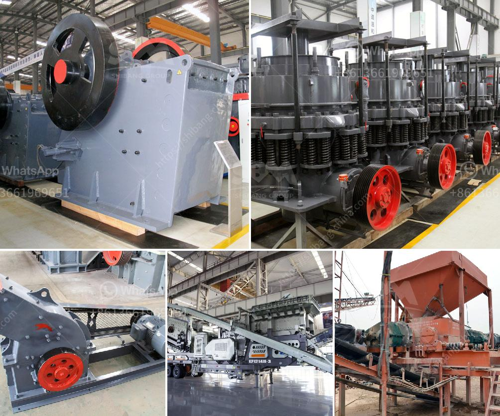

<h3>coltan processing plant prices</h3>
Coltan, short for columbite-tantalite, is a valuable mineral found in abundance in the eastern Democratic Republic of Congo (DRC). This mineral is crucial in the manufacturing of electronic devices such as smartphones, tablets, and laptops due to its unique properties. However, the processing of coltan is a complex and costly operation that requires specialized equipment and expertise.

When it comes to establishing a coltan processing plant, several key factors influence the overall prices involved. These factors include equipment costs, raw material availability, labor, and environmental regulations. Let's delve into each of these factors to gain a better understanding.

One of the primary cost drivers for a coltan processing plant is the equipment required. Processing plants need crushers, screens, magnetic separators, and other machinery to efficiently extract tantalum and niobium from coltan ore. The cost of this equipment can vary depending on factors such as quality, location, and the size of the operation. High-quality equipment tends to have a higher purchase price but offers better efficiency and durability, reducing maintenance and downtime costs in the long run.

Another significant factor that affects coltan processing plant prices is the availability of raw materials. Coltan is primarily found in the DRC, where political instability and conflict have often led to supply disruptions. These disruptions can result in higher prices as operators must navigate complex supply chains and seek alternative sources. Additionally, obtaining mining rights and securing a reliable supply chain can involve additional costs.

Labor costs also play a crucial role in determining the overall price of establishing and operating a coltan processing plant. Labor-intensive processes such as manual sorting and testing require skilled workers, who must be properly trained and compensated. Additionally, safety regulations and labor laws may vary across different regions, impacting labor costs. It is essential for coltan processing plant operators to strike a balance between skilled labor costs and operational efficiency.

Stringent environmental regulations are another factor affecting coltan processing plant prices. Coltan mining and processing can have a significant impact on the environment if not properly managed. Compliance with environmental regulations requires the implementation of mitigation measures, such as waste management systems and responsible water usage, which can incur additional costs. However, adhering to these regulations is crucial to ensure sustainable and responsible coltan production.

In conclusion, coltan processing plant prices are influenced by several key factors, including equipment costs, raw material availability, labor, and environmental regulations. The cost of equipment can vary based on quality and location, while ensuring a reliable supply chain is crucial due to potential supply disruptions. Labor costs should be balanced with operational efficiency, and compliance with environmental regulations is necessary for responsible production. By understanding these factors, stakeholders can make informed decisions regarding the establishment and operation of coltan processing plants, contributing to the sustainable and ethical sourcing of this valuable mineral.
<h3>Contact us</h3><ul><li><strong>Whatsapp:&nbsp;<a href="https://wa.me/8613661969651">+8613661969651</a></strong></li><li><a href="https://swt.shibang-china.com/?git&amp;zhl&amp;coltan processing plant prices"><strong>Online Service(chat now)</strong></a></li></ul><h3>Related</h3><ul><li><a href='micro grinding mill.md'>micro grinding mill</a></li><li><a href='mobile crusher for sale in south africa.md'>mobile crusher for sale in south africa</a></li><li><a href='used ball mill machine capacity in indonesia.md'>used ball mill machine capacity in indonesia</a></li><li><a href='china clay processing plant cost in india.md'>china clay processing plant cost in india</a></li><li><a href='belt conveyor system manufacturers.md'>belt conveyor system manufacturers</a></li></ul>