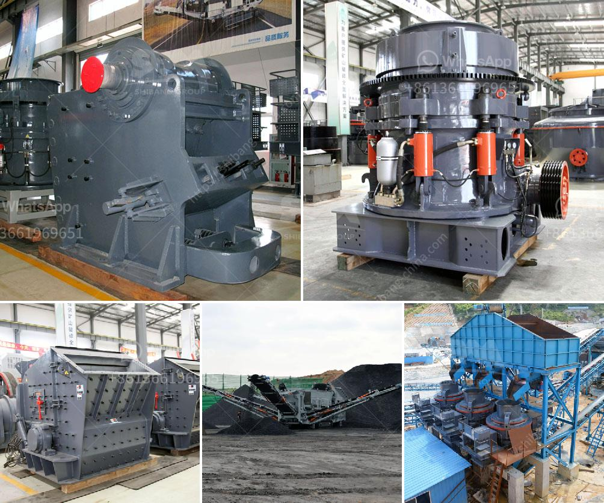

<h3>companies of panama conveyor belts</h3>
Conveyor belts have become a fundamental component in various industries, ensuring a smooth flow of materials and increasing operational efficiency. In Panama, several companies have emerged as leading providers of conveyor belts, catering to the needs of diverse sectors. These companies are revolutionizing industries by offering high-quality products and exceptional customer service.

One prominent company in the field is ABC Conveyor Belts, a Panama-based manufacturing company with years of experience. They specialize in fabricating and distributing conveyor belts tailored to specific industry requirements. With their cutting-edge technology and skilled workforce, they design belts that can withstand heavy loads, extreme temperatures, and corrosive substances. ABC Conveyor Belts has become a reliable partner for industries such as agriculture, mining, and logistics in the region.

Another significant player is XYZ Industrial Solutions, known for its comprehensive range of conveyor belts. They pride themselves on offering innovative solutions to industries grappling with complex material handling challenges. Their product portfolio includes conveyor belts for bulk materials, incline and decline applications, as well as specialized belts for the food and beverage industry. XYZ Industrial Solutions has established itself as a trusted partner that provides reliable products and expert advice to businesses across Panama.

Furthermore, ZYX Conveyors is a company that has gained recognition for its exceptional customer service. They excel in understanding clients' unique needs and providing tailor-made solutions. ZYX Conveyors' expert technicians are readily available for installation, maintenance, and repairs, ensuring uninterrupted operation for businesses. Their commitment towards customer satisfaction has made them a go-to choice for a wide range of industries in Panama.

These companies, along with others, have significantly contributed to the growth and efficiency of various industries in Panama. By supplying top-of-the-line conveyor belts that improve productivity and reduce downtime, they have helped businesses streamline their operations, reducing costs and enhancing overall profitability.

Panama's conveyor belt companies are well-positioned to cater to not only local industries but also international markets. The country's strategic location as a hub for trade and logistics has attracted a growing number of industries that rely on conveyor belts for their operations. As a result, these companies have continuously invested in research and development, adopting newer technologies and incorporating sustainable and eco-friendly practices.

In conclusion, the companies of Panama Conveyor Belts are revolutionizing industries and transforming the way materials are handled and processed. With their high-quality products, innovative solutions, and exceptional customer service, they have become key players in the growth and development of various sectors. As industries continue to evolve, these companies will undoubtedly play a crucial role in shaping the future of material handling operations in Panama and beyond.
<h3>Contact us</h3><ul><li><strong>Whatsapp:&nbsp;<a href="https://wa.me/8613661969651">+8613661969651</a></strong></li><li><a href="https://swt.shibang-china.com/?git&amp;zhl&amp;companies of panama conveyor belts"><strong>Online Service(chat now)</strong></a></li></ul><h3>Related</h3><ul><li><a href='basalt crushing plant.md'>basalt crushing plant</a></li><li><a href='mobile cone crusher zenith.md'>mobile cone crusher zenith</a></li><li><a href='sliding shoe bearing ball mill skf.md'>sliding shoe bearing ball mill skf</a></li><li><a href='operation crushing plant.md'>operation crushing plant</a></li><li><a href='stone crusher plant in turkey.md'>stone crusher plant in turkey</a></li></ul>