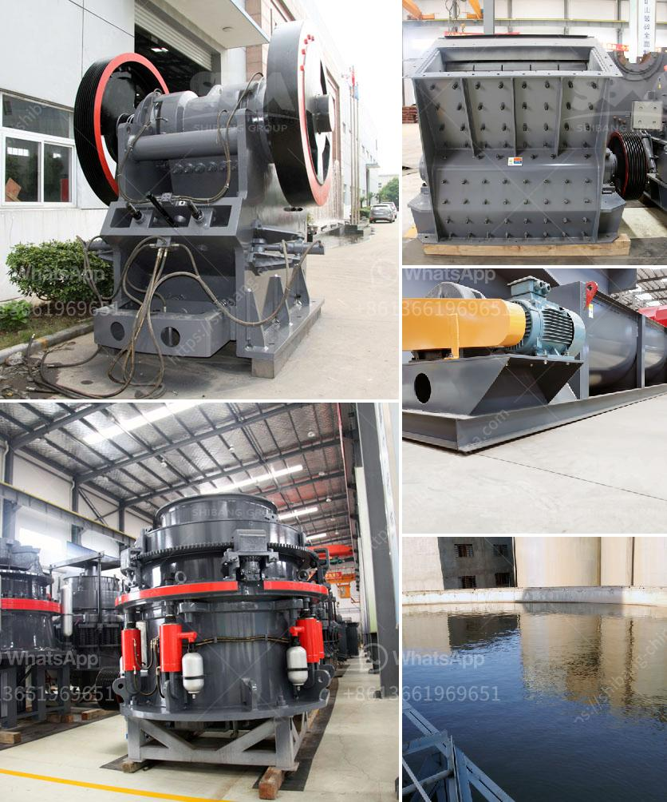

<h3>companies rent vibrating screens</h3>
In today's fast-paced business environment, companies across various industries are constantly seeking innovative solutions to maximize productivity and efficiency. When it comes to material separation, vibrating screens have become a vital tool to ensure the smooth flow of operations. However, purchasing these screens may not be a cost-effective option for many organizations. As a result, the trend of renting vibrating screens has gained significant popularity.

Renting vibrating screens offers numerous benefits for businesses, regardless of their size or sector. One key advantage is cost savings. Rather than investing substantial capital in purchasing screens, renting allows companies to allocate their resources more efficiently. This is particularly beneficial for smaller businesses or those that require vibrating screens for shorter durations.

The flexibility of renting is another notable advantage. Companies may experience fluctuations in demand or require screens for specific projects, making ownership impractical. Renting provides the freedom to adjust screen requirements as needed, ensuring optimal performance without unnecessary long-term commitments.

Moreover, renting vibrating screens offers the advantage of access to state-of-the-art technology. Rental companies continually update their equipment to provide cutting-edge technology, ensuring businesses have access to the latest industry advancements without the burden of constant upgrades or maintenance.

Efficiency and ease-of-use are further reasons why renting vibrating screens is a smart choice. Rental companies often provide skilled operators or offer training to ensure smooth operations. By entrusting the experts, businesses can focus on their core operations, saving valuable time and resources.

Safety is also a critical consideration. Vibrating screens involve complex machinery that requires expert handling to minimize risks. Rental companies ensure compliance with safety standards, alleviating concerns related to training and potentially hazardous situations.

In conclusion, the decision to rent vibrating screens can be a game-changer for companies striving for enhanced productivity and efficiency. The cost savings, flexibility, access to cutting-edge technology, efficient operation, and safety measures make renting an attractive option. By partnering with professional rental companies, businesses can reap the benefits of vibrating screens, without the burden of hefty investment, maintenance, and operational concerns. So, whether a short-term requirement or a long-term solution, renting vibrating screens is a smart choice for companies seeking efficient material separation.
<h3>Contact us</h3><ul><li><strong>Whatsapp:&nbsp;<a href="https://wa.me/8613661969651">+8613661969651</a></strong></li><li><a href="https://swt.shibang-china.com/?git&amp;zhl&amp;companies rent vibrating screens"><strong>Online Service(chat now)</strong></a></li></ul><h3>Related</h3><ul><li><a href='pe 400 by 600 single toggle jaw crusher specifications.md'>pe 400 by 600 single toggle jaw crusher specifications</a></li><li><a href='basalt crusher production.md'>basalt crusher production</a></li><li><a href='aggregate crusher for sale in philippines.md'>aggregate crusher for sale in philippines</a></li><li><a href='japan of mobile crushing plant.md'>japan of mobile crushing plant</a></li><li><a href='coal washing plant for sale grinding mill china.md'>coal washing plant for sale grinding mill china</a></li></ul>