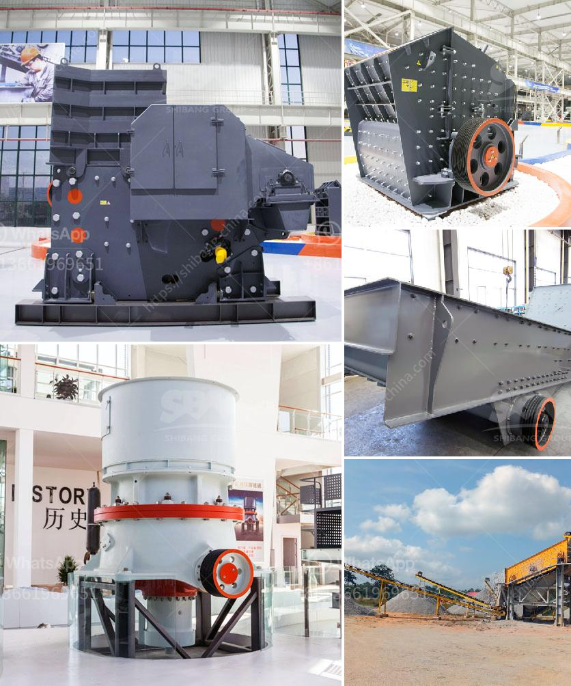

<h3>complete crusher plant for sale south africa</h3>
A complete crusher plant, also known as a crushing plant, is a combination of different types of equipment that together act as a powerful crushing and screening setup. It can be used for a variety of materials, including but not limited to crushed rock, sand, gravel, and construction aggregates.

South Africa has a wide range of mineral resources and it is a leading producer and exporter of gold, platinum group metals, chrome ore, and manganese ore. The country also has large deposits of various other minerals, including coal, iron ore, copper, and zinc. The mining sector in South Africa employs a large number of workers and plays a crucial role in the country's economy.

When it comes to the extraction and processing of these valuable minerals, a complete crusher plant becomes an essential tool for the mining industry. It is used to crush large rocks and turn them into smaller, more manageable sizes that can be further processed.

A typical complete crusher plant consists of primary crushers, secondary crushers, screens, and conveyors. The primary crushers are responsible for reducing the initial size of the rocks, while the secondary crushers further break them down into the desired sizes. Screens are used to separate different sizes of crushed materials, and conveyors are used to transport the materials between different stages of the crushing process.

There are different types of complete crusher plants available in the market, depending on the specific requirements of the mining operation. Some plants are designed for large-scale mining operations, where tons of materials need to be processed daily. These plants are usually equipped with heavy-duty crushers and high-capacity screens to handle the large volumes of material.

On the other hand, there are also smaller, more compact crusher plants available for smaller mining operations or for crushing specific materials. These plants may be more mobile and versatile, allowing them to be easily transported between different mining sites.

One of the advantages of a complete crusher plant is its ability to reduce the need for manual labor. Instead of manually breaking down rocks, workers can feed the materials into the crushers and let the machines do the rest of the work. This not only increases efficiency but also improves safety by reducing the risk of accidents and injuries.

In South Africa, complete crusher plants are commonly used in mining operations, especially in the production of aggregates and construction materials. These plants can produce a wide range of products, including crushed rock, sand, gravel, and various other materials used in building and infrastructure projects.

If you are in the mining industry in South Africa and looking for a complete crusher plant for sale, there are various manufacturers and suppliers to choose from. It is important to consider factors such as the capacity of the plant, the specific requirements of your mining operation, and the after-sales service and support provided by the manufacturer.

In conclusion, a complete crusher plant is an essential tool in the mining industry in South Africa. It is used to crush and screen various materials, turning them into smaller, more manageable sizes for further processing. Whether you need a plant for large-scale mining operations or smaller-scale projects, there are various options available to suit your specific needs.
<h3>Contact us</h3><ul><li><strong>Whatsapp:&nbsp;<a href="https://wa.me/8613661969651">+8613661969651</a></strong></li><li><a href="https://swt.shibang-china.com/?git&amp;zhl&amp;complete crusher plant for sale south africa"><strong>Online Service(chat now)</strong></a></li></ul><h3>Related</h3><ul><li><a href='cement clinker grinding unit.md'>cement clinker grinding unit</a></li><li><a href='friendly gold mining equipment.md'>friendly gold mining equipment</a></li><li><a href='biggest cone crusher in africa.md'>biggest cone crusher in africa</a></li><li><a href='stone crusher manufacturer turkey.md'>stone crusher manufacturer turkey</a></li><li><a href='equipment used in iron ore beneficiation.md'>equipment used in iron ore beneficiation</a></li></ul>