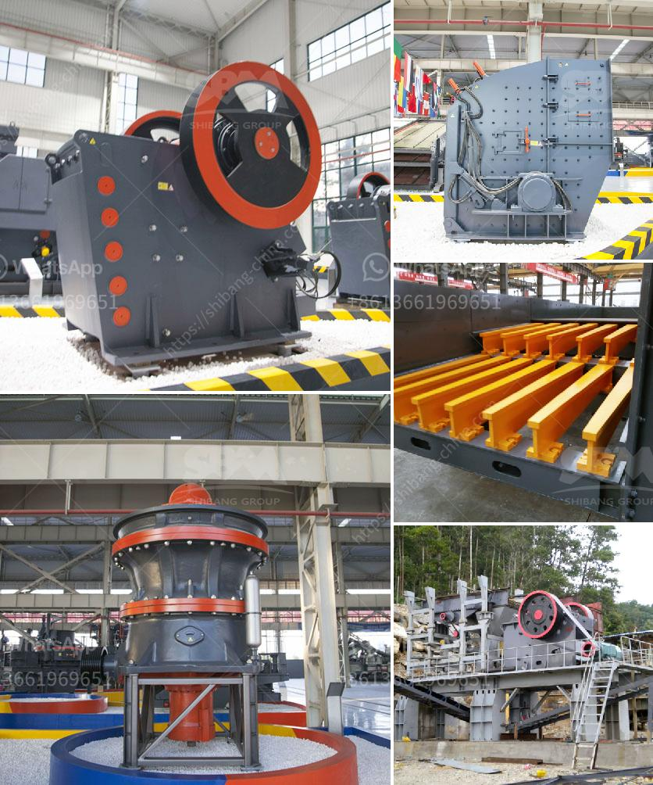

<h3>complete mobile stone crushing machine</h3>
Mobile stone crushing machine, also known as a stone crusher, is a machine that converts aggregate into sand or gravel. It is designed to reduce large rocks into smaller rocks or gravel. Mobile stone crushing machines are widely used in the mining industry for crushing various materials such as granite, limestone, coal, pebble, and construction waste.

One of the key features of a mobile stone crushing machine is its portability. This allows the machine to be easily moved and operated on various job sites, making it ideal for on-site crushing. With a complete mobile stone crushing machine, contractors and quarry operators no longer need to transport large quantities of materials to the crushing site. Instead, they can bring the machine to the material source, saving time and money.

A complete mobile stone crushing machine typically consists of several units, including a primary crushing unit, a secondary crushing unit, and a screening unit. Each unit is interdependent and works together to achieve the desired end product. The primary crushing unit is responsible for reducing the size of the material to a manageable size. It often consists of a jaw crusher or impact crusher.

The secondary crushing unit further reduces the material to the desired size. It can be equipped with a cone crusher or a vertical shaft impact crusher. The choice of the crushing unit depends on the type of material being processed and the desired end product. The screening unit is responsible for separating the crushed material into different sizes.

Mobile stone crushing machines are powered by a diesel engine or an electric motor. The choice of the power source depends on the availability of fuel and the specific requirements of the job site. Diesel-powered machines are commonly used in remote areas or where electricity is not readily available. They provide greater mobility and can be easily refueled.

In addition to the primary, secondary, and screening units, a complete mobile stone crushing machine may also include a conveyor system to transport the crushed material to a desired location. Conveyors are essential for efficient and continuous material handling.

The advantages of a complete mobile stone crushing machine are numerous. It eliminates the need for expensive transportation of materials to the crushing site. Instead, the machine can be brought to the material source, saving time and resources. It also provides greater flexibility and mobility, allowing operators to easily move and operate the machine on different job sites.

Furthermore, a complete mobile stone crushing machine offers cost savings. It reduces the need for manual labor and the use of additional machinery. The machine is designed to efficiently process large quantities of material, resulting in increased productivity and reduced operating costs.

In conclusion, a complete mobile stone crushing machine is a versatile and efficient equipment that offers numerous benefits to the mining industry. Its portability, flexibility, and cost-effectiveness make it an ideal choice for crushing various materials on-site. Whether it is for a small-scale construction project or a large quarry operation, a complete mobile stone crushing machine can help streamline the process, increase productivity, and deliver high-quality end products.
<h3>Contact us</h3><ul><li><strong>Whatsapp:&nbsp;<a href="https://wa.me/8613661969651">+8613661969651</a></strong></li><li><a href="https://swt.shibang-china.com/?git&amp;zhl&amp;complete mobile stone crushing machine"><strong>Online Service(chat now)</strong></a></li></ul><h3>Related</h3><ul><li><a href='washing powder production line.md'>washing powder production line</a></li><li><a href='screening and crusher for sale.md'>screening and crusher for sale</a></li><li><a href='graphite beneficiation plant at nigeria.md'>graphite beneficiation plant at nigeria</a></li><li><a href='calcium carbonate grinding industries in india.md'>calcium carbonate grinding industries in india</a></li><li><a href='stone crusher primary jaw to buy in nigeria.md'>stone crusher primary jaw to buy in nigeria</a></li></ul>