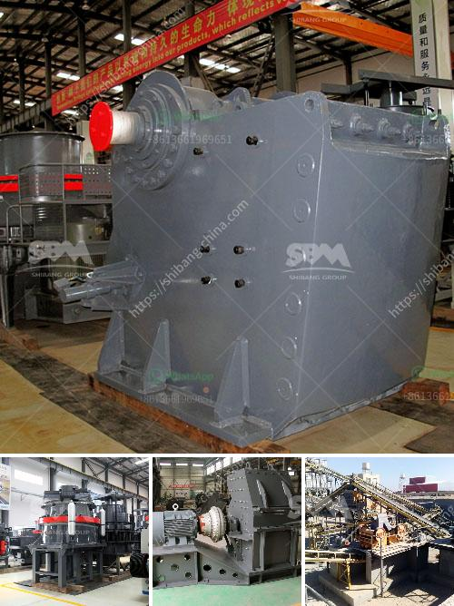

<h3>complete stone crushing 300 tph plant</h3>
Stone crushing plant is applied widely to crush limestone, coal, marble, quartz, granite, recycle construction materials such as debris, asphaltic cement concrete, ore, and other minerals. Eastman single-cylinder hydraulic cone crusher is engineered for the toughest crushing applications, delivering enhanced performance and high durability. Our company is based in India, and we provide unmatched services to customers all over the nation. With state-of-the-art infrastructure, advanced technology, and a team of highly skilled professionals, we are committed to delivering comprehensive stone crushing solutions that meet our customers' requirements.

The 300 TPH stone crushing plant is designed for medium scale stone quarrying plant, aggregate plant, mineral beneficiation plant, and so on. The production capacity of this stone crushing plant can achieve 300 TPH, which is very efficient and cost-effective. The crushing plant can easily provide uniform products in a relatively short period of time.

The major components of the complete stone crushing plant include a vibrating feeder, a jaw crusher, a cone crusher, a vibrating screen, and belt conveyors. The crushing plant is commonly used for crushing hard materials, such as granite, basalt, limestone, pebble, and construction waste materials. The impact crusher combines high-performing impact crushing with precision engineering and selective crushing, making it a top-performing machine in the stone crushing process.

The stone crushing plant is flexible and can be configured according to clients' requirements. The cone crusher and impact crusher are both ideal portable crushing equipment for portable stone crushing plants, ensuring the finished product has a precise cubical shape. With advanced technology and equipment, natural river pebble, basalt, granite, and other materials can be effectively crushed in our 300 TPH stone crushing plant.

Our extensive range of high performing crusher plants is designed to optimize your productivity, reduce downtime, and enhance profitability. Our experienced team will work closely with you to ensure we provide a solution that meets your specific needs. We are committed to delivering reliable, efficient, and eco-friendly solutions that exceed our customers' expectations.

In addition to the stone crushing equipment mentioned above, we also provide an auxiliary equipment, such as a vibrating feeder, vibrating screen, belt conveyors, etc. These machines can be customized to fit different production requirements, ensuring a smooth and efficient operation of the stone crushing plant.

At Eastman, we prioritize customer satisfaction above everything else. We strive to provide excellent products, prompt delivery, and outstanding after-sales service to our customers. Our customer support team is available 24/7 to assist with any inquiries or technical assistance you may require.

In conclusion, our complete stone crushing 300 TPH plant delivers efficient and reliable performance, backed by our commitment to customer satisfaction. With our expertise and experience in the stone crushing industry, we are confident in delivering exceptional crushing solutions that will exceed your expectations. Contact us today to discuss your stone crushing plant requirements and let us assist you in achieving your production goals.
<h3>Contact us</h3><ul><li><strong>Whatsapp:&nbsp;<a href="https://wa.me/8613661969651">+8613661969651</a></strong></li><li><a href="https://swt.shibang-china.com/?git&amp;zhl&amp;complete stone crushing 300 tph plant"><strong>Online Service(chat now)</strong></a></li></ul><h3>Related</h3><ul><li><a href='calcuim production machines.md'>calcuim production machines</a></li><li><a href='small scale gold mining equipment for sale auction.md'>small scale gold mining equipment for sale auction</a></li><li><a href='calcite grinding plant.md'>calcite grinding plant</a></li><li><a href='continuous ball mill for sale in malaysia.md'>continuous ball mill for sale in malaysia</a></li><li><a href='business plan on manganese ore mining crusher.md'>business plan on manganese ore mining crusher</a></li></ul>