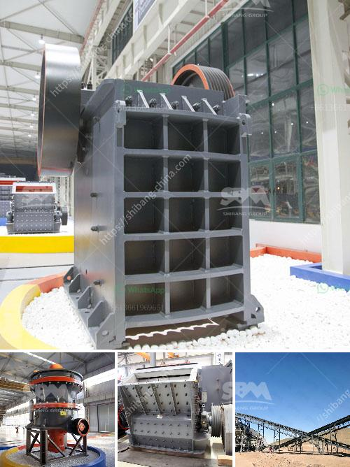

<h3>component of jaw crusher</h3>
A jaw crusher is a unique machine that is widely used in various industries like mining, construction, metallurgy, highway construction, and chemical industries. Jaw crushers are usually designed using the primary stage crushing, second stage crushing, and the third stage crushing process.

1. Jaw Plates: These are the fixed and movable plates that provide support to the jaws of the crusher. This ensures that the crushing material remains in place and minimizes the possibility of slipping or shifting.

2. Eccentric Shaft: This is a crucial component that helps in the movement of the swing jaw. The eccentric shaft is usually made of alloy steel and is mounted on the bearings, ensuring smooth operation of the jaw crusher.

3. Toggle Plate: The toggle plate is positioned at the bottom of the swing jaw and provides support to the moving jaw. It ensures that the crushing force is evenly distributed across the jaw plates, enhancing the efficiency of the crusher.

4. Pitman: The pitman is the main moving part of the jaw crusher. It transfers the crushing motion to the jaw plates and ensures smooth operation. The design of the pitman is crucial as it determines the crushing capacity and durability of the crusher.

5. Flywheel: The flywheel is a rotating part that helps in storing the kinetic energy of the crusher during the crushing process. It helps in maintaining the speed and momentum of the moving jaw, ensuring efficient crushing.

6. Bearings: Bearings play a crucial role in the smooth operation of the jaw crusher. They help in reducing the friction and heat generated during the crushing process, ensuring longer life and optimal performance.

In conclusion, the components of a jaw crusher are essential for its efficient operation and longevity. Each component has its unique role and contributes to the overall performance of the crusher. Therefore, it is crucial to pay attention to the quality and maintenance of these components to ensure the smooth functioning of the jaw crusher in various industries.
<h3>Contact us</h3><ul><li><strong>Whatsapp:&nbsp;<a href="https://wa.me/8613661969651">+8613661969651</a></strong></li><li><a href="https://swt.shibang-china.com/?git&amp;zhl&amp;component of jaw crusher"><strong>Online Service(chat now)</strong></a></li></ul><h3>Related</h3><ul><li><a href='hammer mill capacity.md'>hammer mill capacity</a></li><li><a href='used calcite powder plant and machinery.md'>used calcite powder plant and machinery</a></li><li><a href='ballast crushers alibaba.md'>ballast crushers alibaba</a></li><li><a href='mineral processing equipment.md'>mineral processing equipment</a></li><li><a href='machine crusher prices in nigeria.md'>machine crusher prices in nigeria</a></li></ul>