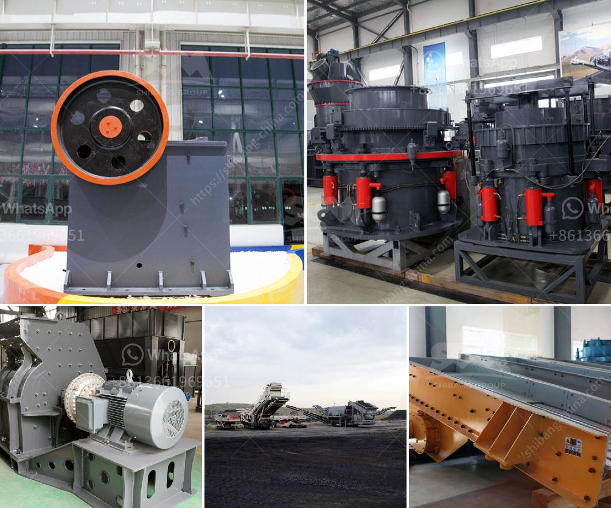

<h3>components of mobile coal processing plant</h3>
Coal is a valuable resource that provides energy and is used extensively in various industries worldwide. To efficiently process coal and generate the desired products, a mobile coal processing plant can be employed. This type of plant is designed to be easily transported from one location to another, making it highly flexible and suitable for both mining operations and remote areas.

A mobile coal processing plant consists of several components that work together to process raw coal into different products. Let's explore these components in more detail.

1. Coal Preparations System: This component is responsible for receiving raw coal and preparing it for further processing. The coal is usually received in a storage yard and then fed into a hopper or a crusher, where it is crushed to a smaller size. This system also includes equipment such as screens and separators, which are used to remove impurities and separate coal particles based on size.

2. Coal Washing Unit: After the coal is crushed, it is typically sent to a coal washing unit. In this unit, the coal is mixed with water and various chemicals to remove impurities and separate coal from ash, sulfur, and other unwanted elements. Washing coal improves its heating value, reduces emissions during combustion, and increases its market value.

3. Dewatering System: The dewatering system is responsible for reducing the moisture content of the washed coal. This is essential for efficient transportation and storage of coal. Various techniques, such as centrifuges and filters, are used to remove excess water and achieve the desired moisture content.

4. Crushing and Screening Unit: Once the coal is washed and dewatered, it is ready to be crushed and screened into different sizes. This unit consists of crushers and screens that further process the coal to meet specific requirements. Different sizing options are available based on the end-use of the coal, such as power generation or industrial applications.

5. Stockpile and Loading System: The final step in the mobile coal processing plant is the stockpiling and loading of processed coal. This system includes conveyor belts, stackers, reclaimers, and loading facilities. The processed coal is transported on a conveyor and stacked in designated stockpiles. From the stockpiles, the coal can be loaded onto trucks, trains, or barges for transport to end-users or storage facilities.

The mobility of a mobile coal processing plant offers several advantages. Firstly, it allows for easier relocation between mining sites or remote areas, minimizing downtime and reducing costs associated with site preparation. Secondly, it enables quick response to changes in demand or market conditions. Additionally, a mobile plant is often more environmentally friendly, as it can be equipped with advanced emission control systems.

In summary, a mobile coal processing plant comprises various components, including coal preparations, washing, dewatering, crushing and screening, and stockpile and loading systems. These components work together to process raw coal into products that meet specific requirements. The mobility of the plant provides flexibility, making it ideal for mining operations and remote areas. With its efficiency and adaptability, a mobile coal processing plant plays a significant role in the coal industry.
<h3>Contact us</h3><ul><li><strong>Whatsapp:&nbsp;<a href="https://wa.me/8613661969651">+8613661969651</a></strong></li><li><a href="https://swt.shibang-china.com/?git&amp;zhl&amp;components of mobile coal processing plant"><strong>Online Service(chat now)</strong></a></li></ul><h3>Related</h3><ul><li><a href='crusher plant quarry philippines.md'>crusher plant quarry philippines</a></li><li><a href='russia equipment manufacturers mining.md'>russia equipment manufacturers mining</a></li><li><a href='eagle 1400 crusher for sale.md'>eagle 1400 crusher for sale</a></li><li><a href='quote for cone crusher.md'>quote for cone crusher</a></li><li><a href='jaw crusher for sale china.md'>jaw crusher for sale china</a></li></ul>