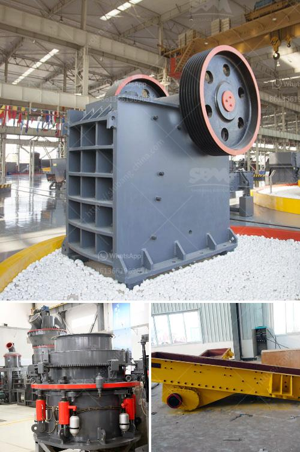

<h3>composetion of terracotta tiles</h3>
Terracotta tiles have long been a popular choice for both indoor and outdoor spaces, thanks to their rustic charm and timeless appeal. These tiles are composed of clay that has been fired at high temperatures, resulting in a durable and versatile material that is suitable for various applications.

The composition of terracotta tiles primarily consists of natural clay, which plays a crucial role in their characteristics and performance. Clay is a sedimentary material that is formed from the weathering and erosion of rocks over thousands of years. It is rich in minerals such as silica, alumina, and iron oxide, which give terracotta tiles their distinctive color and texture.

Manufacturers follow a carefully controlled process to create terracotta tiles. The first step involves mining or extracting clay from the earth. The clay is then purified to remove any impurities and unwanted substances. This ensures that the final product is of high quality and consistent in its composition.

Once the clay is purified, it undergoes a process called molding. This involves shaping the clay into tiles of various sizes and thicknesses. Traditional terracotta tiles are often handmade, giving them a unique and rustic appearance. However, modern techniques use machines to mold the clay, ensuring uniformity and precision in the final product.

After molding, the terracotta tiles are left to dry naturally or in kilns. This allows the excess moisture to evaporate, making the tiles stronger and less prone to cracking or warping. The drying process can take several days, depending on the thickness of the tiles and the environmental conditions.

Once the tiles are dry, they are ready for firing. Firing is a crucial step that transforms the clay into a solid, durable material. The tiles are placed in kilns and heated to high temperatures, typically between 900 and 1100 degrees Celsius. This process, known as vitrification, causes the clay particles to fuse together, creating a dense and resilient tile.

The firing temperature and duration can vary depending on the desired color and finish of the terracotta tiles. Higher firing temperatures result in darker shades, while lower temperatures produce lighter hues. Additionally, manufacturers may apply a glaze or sealant to the tiles to enhance their appearance, protect them from stains, and improve their longevity.

Terracotta tiles offer numerous advantages beyond their aesthetic appeal. They are highly durable and resistant to wear, making them suitable for high-traffic areas. Their natural composition also makes them an eco-friendly choice, as they are derived from sustainable materials and require minimal energy during production.

Moreover, terracotta tiles have excellent thermal properties, keeping spaces cool during hot summers and warm during colder seasons. They are also relatively low-maintenance, requiring only regular cleaning and occasional sealing to maintain their beauty and performance.

In conclusion, the composition of terracotta tiles primarily revolves around natural clay, which is molded, dried, and fired to create a durable and versatile material. With their unique aesthetic and practical benefits, terracotta tiles continue to be a popular choice for homeowners and designers seeking to bring classic warmth and character to their spaces.
<h3>Contact us</h3><ul><li><strong>Whatsapp:&nbsp;<a href="https://wa.me/8613661969651">+8613661969651</a></strong></li><li><a href="https://swt.shibang-china.com/?git&amp;zhl&amp;composetion of terracotta tiles"><strong>Online Service(chat now)</strong></a></li></ul><h3>Related</h3><ul><li><a href='small bleaching powder manufacturing plant project report.md'>small bleaching powder manufacturing plant project report</a></li><li><a href='ballast crushers in kenya.md'>ballast crushers in kenya</a></li><li><a href='dry and wet process of cement manufacturing pdf.md'>dry and wet process of cement manufacturing pdf</a></li><li><a href='coal mill reject conveying system.md'>coal mill reject conveying system</a></li><li><a href='gypsum recycling machines for sale.md'>gypsum recycling machines for sale</a></li></ul>