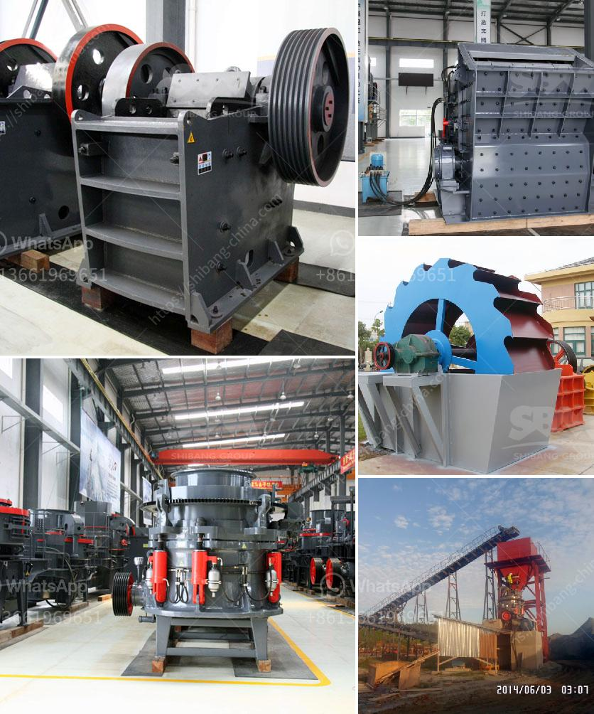

<h3>concrete aggregates crushing plant for sale</h3>
A concrete aggregates crushing plant is a facility that is built to crush and grind the concrete into the desired size. Recycling concrete aggregates allows for the reuse of materials as well as the reduction of carbon footprint and landfill waste. It is an eco-friendly alternative to traditional demolition and construction practices.

When considering the purchase of a concrete aggregates crushing plant, there are several factors to consider. One of the main considerations is the capacity of the plant. The capacity of the plant should be able to meet the demands of the construction project. A plant with a capacity of 100-300 tons per hour is suitable for most construction projects.

Another factor to consider is the efficiency of the plant. An efficient crushing plant will ensure that the concrete aggregates are crushed and separated into the desired size efficiently and accurately. This will not only save time but also reduce energy consumption.

Furthermore, it is important to consider the maintenance and operational costs of the plant. A well-maintained plant with low operational costs will ensure that the project remains within budget. Additionally, it is important to choose a plant with a reliable warranty and after-sales service.

A concrete aggregates crushing plant for sale is an investment that provides returns for years to come. It will help companies reduce their environmental impact and save money by recycling concrete waste. With the increasing demand for sustainable construction practices, a concrete aggregates crushing plant is a valuable asset for any construction company.

In conclusion, a concrete aggregates crushing plant for sale is an efficient and eco-friendly solution for the recycling of construction waste. It offers numerous benefits for both the environment and the construction industry. When considering the purchase of a plant, it is important to consider factors such as capacity, efficiency, and maintenance costs. With the right choice, companies can significantly reduce their carbon footprint and contribute to a greener future.
<h3>Contact us</h3><ul><li><strong>Whatsapp:&nbsp;<a href="https://wa.me/8613661969651">+8613661969651</a></strong></li><li><a href="https://swt.shibang-china.com/?git&amp;zhl&amp;concrete aggregates crushing plant for sale"><strong>Online Service(chat now)</strong></a></li></ul><h3>Related</h3><ul><li><a href='magnetic separator distributor in surabaya.md'>magnetic separator distributor in surabaya</a></li><li><a href='vsi crusher machine.md'>vsi crusher machine</a></li><li><a href='cost of tph stage crushing plant.md'>cost of tph stage crushing plant</a></li><li><a href='silica sand mines in philippines.md'>silica sand mines in philippines</a></li><li><a href='sand vsi crusher.md'>sand vsi crusher</a></li></ul>