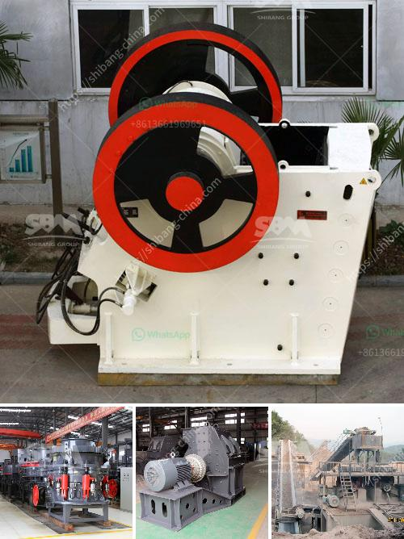

<h3>concrete crusher business proposal</h3>
Concrete crushers are an essential piece of machinery for various construction firms and rental companies. As the construction industry continues to evolve, companies are looking for equipment that can handle heavy-duty demolition work with ease. The concrete crusher is the ideal solution for those that require a hassle-free and efficient means of demolishing and recycling concrete materials. 

The proposal for concrete crusher businesses to recycle the waste concrete and turn it into valuable aggregate is gaining popularity among construction firms. This not only provides an eco-friendly solution but also helps reduce construction costs significantly. By crushing and recycling concrete on-site, companies can save on transportation costs and reduce the need for landfill space.

To start a concrete crusher business, one needs to carefully plan and execute the necessary steps. First and foremost, it is essential to conduct thorough research on market demand, competition, and potential clientele. Understanding the local regulations regarding recycling and waste disposal is crucial for compliance and smooth operations.

Investing in quality equipment is equally important. A concrete crusher should be robust, reliable, and capable of handling different types of concrete materials. Consider factors such as crushing capacity, feed opening size, and maintenance requirements when selecting a crusher for your business. Additionally, transportability is a crucial aspect, especially if you plan to offer mobile crushing services.

An effective marketing strategy is vital to attract customers and create awareness about your concrete crusher business. Develop a professional website, create online listings, and actively engage with construction firms and contractors through networking events and industry exhibitions. Offering competitive pricing, excellent customer service, and timely project completion will contribute to building a strong reputation in the market.

In conclusion, starting a concrete crusher business can be a lucrative venture for entrepreneurs in the construction industry. By offering a sustainable solution for recycling concrete waste, this business model addresses the growing demand for environmentally friendly practices. Through market research, investing in quality equipment, and implementing effective marketing strategies, entrepreneurs can establish a successful concrete crusher business.
<h3>Contact us</h3><ul><li><strong>Whatsapp:&nbsp;<a href="https://wa.me/8613661969651">+8613661969651</a></strong></li><li><a href="https://swt.shibang-china.com/?git&amp;zhl&amp;concrete crusher business proposal"><strong>Online Service(chat now)</strong></a></li></ul><h3>Related</h3><ul><li><a href='stone crusher machine in peru.md'>stone crusher machine in peru</a></li><li><a href='pure north crushing plant.md'>pure north crushing plant</a></li><li><a href='concrete crushers for rent.md'>concrete crushers for rent</a></li><li><a href='crusher and screening plant.md'>crusher and screening plant</a></li><li><a href='standards sizes of conveyor belts.md'>standards sizes of conveyor belts</a></li></ul>