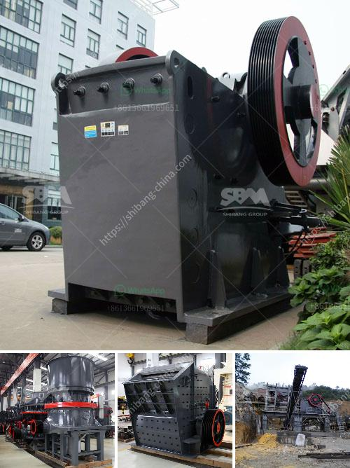

<h3>concrete crusher for sale used in canada</h3>
Concrete crusher is the essential equipment in the mining machinery industry. It can break large pieces of raw materials into small particles and is widely used in sand production line, railway construction and urban construction. The concrete crusher for sale used in Canada has the following characteristics:

In the process of crushing, waste concrete, according to the working principle of more crushing and less grinding, it is necessary to carefully configure the concrete crusher equipment. Jaw crusher, also known as concrete crusher, is usually used as the primary equipment for concrete crushing. It is also suitable for metallurgy, mining, construction, chemical, water conservancy and railway sectors, and used as a device for fine and medium crushing of ores and rocks with compressive strength below 250 Mpa.

The concrete crusher for sale used in Canada has the advantages of reasonable structure, stable operation, simple technique and simple maintenance. The mine crusher is divided into hammer crusher, jaw crusher, impact crusher, etc. It is widely used in mining, smelting, building materials, highway, railway, water conservancy and chemical industries.

The main structure of the concrete crusher is a lower jammed hopper, an upper feeding hopper, a feeding port, an optional mobile device, a hydraulic cylinder, a bracket, a fixed jaw, a movable jaw, a lining plate, a toggle plate, an eccentric shaft and the like. The crushing chamber is composed of a fixed jaw plate and a movable jaw plate. When the material to be crushed enters the crushing chamber, it is crushed by the mutual impact of the jaws. As the feed size decreases, the gap between the two jaws gradually closes, and the crushed material is discharged from the bottom of the crusher by gravity.

With the continuous development of infrastructure construction in Canada, the demand for concrete crusher is increasing. In recent years, due to the rapid development of the construction industry, the ability of concrete crusher to recycle concrete waste has become more and more popular. Concrete crushers are also increasingly being used in mining, cement, chemical and other industries. They have undergone a series of transformations and upgrades, and have played a significant role in promoting the recycling of waste concrete.

Since the concrete crusher plays a crucial role in the recycling of waste concrete, it is necessary to check the equipment regularly and maintain it in a timely manner. Regular maintenance of the concrete crusher can effectively reduce the wear and tear of parts and improve the service life of the equipment. In addition, the equipment should be cleaned regularly to prevent impurities from entering the crusher and affecting its normal operation.

In summary, the concrete crusher for sale used in Canada has the characteristics of simple structure, low cost, high efficiency, and outstanding performance. It is the ideal equipment for processing construction waste into recycled concrete aggregates. With the continuous improvement of technology, the upgrading of equipment, and the increased investment in infrastructure construction, the market demand for concrete crushers in Canada will continue to increase.
<h3>Contact us</h3><ul><li><strong>Whatsapp:&nbsp;<a href="https://wa.me/8613661969651">+8613661969651</a></strong></li><li><a href="https://swt.shibang-china.com/?git&amp;zhl&amp;concrete crusher for sale used in canada"><strong>Online Service(chat now)</strong></a></li></ul><h3>Related</h3><ul><li><a href='chrome ore price in south africa.md'>chrome ore price in south africa</a></li><li><a href='small diesel engine jaw crusher.md'>small diesel engine jaw crusher</a></li><li><a href='brick crusher line production.md'>brick crusher line production</a></li><li><a href='price of grinding mills in uganda.md'>price of grinding mills in uganda</a></li><li><a href='second hand conveyor belt adelaide.md'>second hand conveyor belt adelaide</a></li></ul>