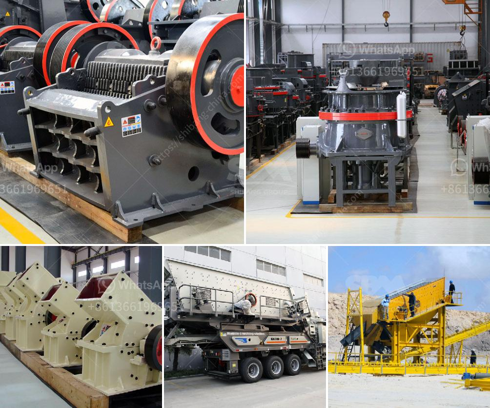

<h3>concrete crusher in kenya</h3>
Concrete crusher in Kenya is used for the breaking of concrete structures on various construction sites, such as bridges, highways, airports, dams, and buildings. Since its introduction in the market, it has proved to be a reliable and efficient machine widely utilized in the construction industry for concrete recycling purposes.

A concrete crusher works by breaking large blocks of concrete into smaller pieces that can be used for various construction projects. In Kenya, numerous buildings and infrastructure projects are being carried out, leading to the accumulation of concrete waste. Utilizing a concrete crusher allows contractors to recycle this waste material, providing them with a cost-effective solution and contributing to environmental sustainability.

The concrete crusher in Kenya is designed to handle even the toughest construction waste materials, including reinforced concrete. Using advanced technology, it crushes the material into reusable sizes in a single pass, reducing the need for additional crushing equipment.

Moreover, the concrete crusher in Kenya is highly portable and can be easily transported from one location to another, making it ideal for on-site crushing operations. This eliminates the need for transportation of concrete waste to recycling plants, saving time and money.

Additionally, using a concrete crusher in Kenya reduces the reliance on traditional methods of concrete disposal, such as landfilling. This not only helps in reducing landfill usage but also minimizes pollution caused by concrete waste.

In conclusion, the concrete crusher in Kenya is a valuable addition to the construction industry, providing an efficient and cost-effective solution for concrete recycling. Its portability and ability to handle various concrete waste materials make it an essential tool for contractors working on construction sites. By adopting this technology, Kenya can contribute to sustainable development, reducing the environmental impact of construction activities while promoting economic growth.
<h3>Contact us</h3><ul><li><strong>Whatsapp:&nbsp;<a href="https://wa.me/8613661969651">+8613661969651</a></strong></li><li><a href="https://swt.shibang-china.com/?git&amp;zhl&amp;concrete crusher in kenya"><strong>Online Service(chat now)</strong></a></li></ul><h3>Related</h3><ul><li><a href='crushing plant tenova.md'>crushing plant tenova</a></li><li><a href='grinding mill grinding mill sale.md'>grinding mill grinding mill sale</a></li><li><a href='sand making crusher machine.md'>sand making crusher machine</a></li><li><a href='jaw crusher moby 600.md'>jaw crusher moby 600</a></li><li><a href='sand crusher for sale.md'>sand crusher for sale</a></li></ul>