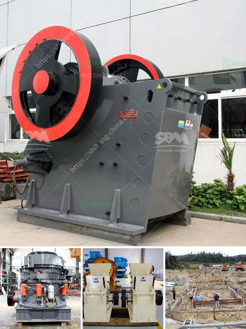

<h3>concrete crusher made in japan</h3>
Japan is renowned for its cutting-edge technology and precision manufacturing, and the concrete crusher is no exception. Designed and manufactured by prominent Japanese companies, these crushers are efficient, reliable, and durable, making them highly sought after in the global construction industry. In this article, we will explore the key features and benefits of concrete crushers made in Japan.

The concrete crushers made in Japan showcase unparalleled technology and design, ensuring optimal performance for various construction tasks. Japanese engineering expertise is leveraged to develop innovative solutions that maximize crushing efficiency, while minimizing noise, dust, and environmental impact.

Japan is known for its meticulous attention to detail, and the concrete crushers manufactured here are no different. These crushers are built using high-quality materials and undergo rigorous quality control processes to ensure exceptional durability. The robust construction allows them to withstand the toughest concrete processing tasks, making them perfectly suited for heavy-duty applications.

The concrete crushers made in Japan feature a cutting-edge crushing mechanism designed to reduce manual labor and improve construction productivity. Developed with precision, these crushers can efficiently break down various materials, including concrete, rocks, and reinforced concrete structures. This advanced technology allows for precise control over the output size, reducing the need for further processing.

User-friendliness is a hallmark of Japanese products, and the concrete crushers are no exception. These machines are designed to be easy to operate, with intuitive controls, allowing operators of all skill levels to quickly adapt. Additionally, routine maintenance is minimal, thanks to the robust construction and high-quality components used in their manufacturing. This ensures minimum downtime and maximum productivity on construction sites.

Japan's commitment to sustainability is reflected in the concrete crushers made here. These crushers are equipped with state-of-the-art dust suppression systems, significantly reducing dust emissions during the crushing process. Furthermore, their low-noise operation ensures minimal disturbance to the surrounding environment. The environmentally friendly design of Japanese-made concrete crushers aligns with global efforts to reduce carbon emissions and promote sustainable construction practices.

The superior quality and performance of concrete crushers made in Japan have gained immense popularity worldwide. Construction companies and contractors across the globe seek out these crushers for their reliability, efficiency, and durability. Japanese manufacturers have established a reputation for delivering high-quality crushing solutions, making their products highly regarded in the global market.

Concrete crushers made in Japan are a testament to the country's engineering excellence and commitment to innovation. These crushers, renowned for their unmatched technology, superior design, and robust construction, offer a revolutionary solution for the construction industry worldwide. With their advanced crushing mechanisms, ease of operation and maintenance, and environmentally friendly features, these crushers are transforming the way concrete materials are processed. Japanese manufacturers continue to pave the way for a more sustainable, efficient, and productive construction industry.
<h3>Contact us</h3><ul><li><strong>Whatsapp:&nbsp;<a href="https://wa.me/8613661969651">+8613661969651</a></strong></li><li><a href="https://swt.shibang-china.com/?git&amp;zhl&amp;concrete crusher made in japan"><strong>Online Service(chat now)</strong></a></li></ul><h3>Related</h3><ul><li><a href='quarry causer machine.md'>quarry causer machine</a></li><li><a href='project report clay brick manufacturing.md'>project report clay brick manufacturing</a></li><li><a href='difference between css or oss crusher.md'>difference between css or oss crusher</a></li><li><a href='china gold processing mills.md'>china gold processing mills</a></li><li><a href='rock crushing plant 100tph.md'>rock crushing plant 100tph</a></li></ul>