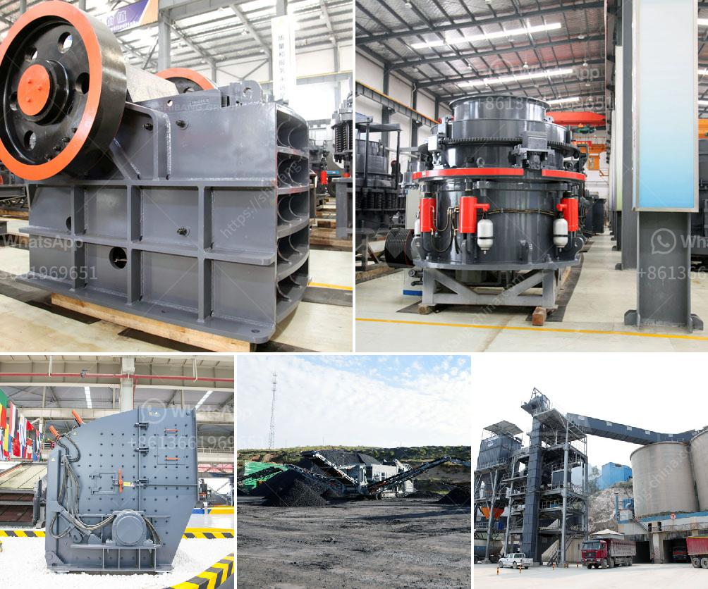

<h3>concrete crushers for rent</h3>
Concrete crushers are popular units that break down large pieces of concrete into smaller, more manageable chunks. These machines render efficiently crushing capabilities, making them perfect for a wide range of applications. Whether you need to recycle construction waste, manage concrete on-site, or simply want to reduce the size of large concrete pieces, a concrete crusher is an ideal choice. In this article, we will explore the benefits of renting a concrete crusher.

Renting a concrete crusher offers numerous advantages over owning one – especially for construction and demolition projects. With limited costs associated with owning and maintaining the equipment, it becomes much easier to complete projects within budget. Moreover, renting allows access to a wider range of crushers that cater to unique project requirements.

One of the primary benefits of renting a concrete crusher is the flexibility it offers. For example, there is no need to invest in a costly purchase if the crusher is only required for a short-term project. By renting, you have the option to choose the right crusher model for each specific task, ensuring optimal performance and efficiency.

Another advantage of renting is that it lowers the equipment's impact on your company's cash flow. Buying a concrete crusher requires a significant upfront investment, which may hinder your ability to allocate resources to other areas of your operation. Renting, on the other hand, enables you to allocate funds to meet other immediate needs. This flexibility is especially important for small and medium-sized businesses.

Additionally, renting a concrete crusher eliminates the need for storage space. Once your project is complete, you can return the crusher to the rental company without worrying about further maintenance or storage costs. This helps keep your worksite clean, organized, and safe.

Renting also provides access to specialized equipment that suits the specific demands of each job. Different crushers offer various features and capabilities, making it essential to select the right model for the task at hand. Renting ensures that you can choose from a diverse range of crushers to match the requirements of each project, whether it involves recycling concrete, removing debris, or crushing large slabs.

Moreover, renting a concrete crusher often includes professional training and support from the rental company. Experienced technicians can guide you through the operation and maintenance of the machine, ensuring its safe and efficient usage. This support can potentially limit downtime due to operator errors or equipment malfunctions.

In conclusion, renting a concrete crusher presents numerous advantages for construction and demolition projects. Offering flexibility, cost-saving benefits, and access to specialized equipment, renting allows you to tackle projects efficiently while managing your budget. Moreover, access to professional support and training ensures optimal machine performances. If you are in need of a reliable concrete crusher, consider renting one to maximize your construction or recycling efforts and minimize costs.
<h3>Contact us</h3><ul><li><strong>Whatsapp:&nbsp;<a href="https://wa.me/8613661969651">+8613661969651</a></strong></li><li><a href="https://swt.shibang-china.com/?git&amp;zhl&amp;concrete crushers for rent"><strong>Online Service(chat now)</strong></a></li></ul><h3>Related</h3><ul><li><a href='china granite jaw crusher.md'>china granite jaw crusher</a></li><li><a href='mining and quarry machines manifactures.md'>mining and quarry machines manifactures</a></li><li><a href='raymond mill plant.md'>raymond mill plant</a></li><li><a href='hammer mill supplier in pretoria.md'>hammer mill supplier in pretoria</a></li><li><a href='sand washer for price.md'>sand washer for price</a></li></ul>