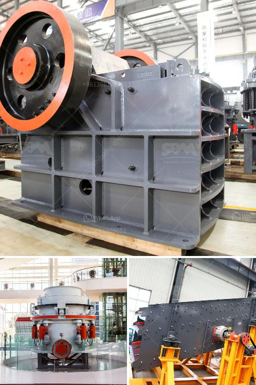

<h3>concrete crushing plant in dubai</h3>
Dubai, one of the seven emirates that make up the United Arab Emirates, is famous for its luxurious hotels, high-end shopping malls, and modern architecture. However, beneath all the glitz and glamour, the city also hosts an array of industrial activities, including the operation of concrete crushing plants.

A concrete crushing plant is a machine that reduces the size of concrete debris through compression, breaking down large pieces into smaller chunks for easier handling, removal, or recycling. One of the primary benefits of using a crushing plant is that it increases the efficiency of waste diversion programs. A properly designed plant can produce high-quality recycled aggregate, which can be used for various construction applications, including road base, pipe bedding, and backfill material.

Dubai's construction industry continues to flourish, with numerous infrastructure projects in the pipeline. As a result, the demand for concrete aggregates is also rapidly increasing. The operation of concrete crushing plants not only helps to meet the demand but also contributes to the overall sustainability of the construction industry.

One of the key factors that make concrete crushing plants in Dubai different from other regions is the regulatory framework governing their operation. Dubai has strict regulations in place to ensure the safe and sustainable operation of all industrial activities, including crushing plants. These regulations cover various aspects, such as air and water quality control, noise levels, waste management, and environmental impact assessments.

To comply with these regulations, concrete crushing plants in Dubai are equipped with advanced dust and noise control systems. The latest technology ensures that the plant operates within permissible limits, minimizing any negative impact on the surrounding environment and nearby communities.

Furthermore, the use of concrete crushing plants in Dubai also helps to conserve natural resources. By recycling concrete debris, the need for extracting and processing virgin aggregates is reduced, resulting in lower energy consumption and less depletion of natural resources. This aligns with the United Arab Emirates' commitment to sustainable development and reducing its ecological footprint.

In addition to its environmental benefits, concrete crushing plants in Dubai offer economic advantages as well. The recycled aggregate produced by these plants can be sold as a cost-effective alternative to natural aggregates, providing a valuable revenue stream. Moreover, using recycled concrete can lead to cost savings for construction projects, as it is usually cheaper than traditional aggregates.

Concrete crushing plants in Dubai play a crucial role in the recycling process. They turn demolition waste into useful materials that can be reused in various construction projects. This not only helps to preserve valuable resources but also contributes to Dubai's goal of becoming a sustainable and eco-friendly city.

In conclusion, concrete crushing plants in Dubai provide an efficient and sustainable solution for the recycling of construction debris. The operation of these plants is regulated to ensure compliance with environmental standards and promote sustainable development. By recycling concrete waste, Dubai not only reduces its ecological footprint but also contributes to the circular economy by turning waste into a valuable resource.
<h3>Contact us</h3><ul><li><strong>Whatsapp:&nbsp;<a href="https://wa.me/8613661969651">+8613661969651</a></strong></li><li><a href="https://swt.shibang-china.com/?git&amp;zhl&amp;concrete crushing plant in dubai"><strong>Online Service(chat now)</strong></a></li></ul><h3>Related</h3><ul><li><a href='coal pulverizer types.md'>coal pulverizer types</a></li><li><a href='costs of calcium carbonate making machinery in japan.md'>costs of calcium carbonate making machinery in japan</a></li><li><a href='gold wash plant equipment in ghana.md'>gold wash plant equipment in ghana</a></li><li><a href='manganese crusher production line.md'>manganese crusher production line</a></li><li><a href='sand dryer for sale in zimbabwe.md'>sand dryer for sale in zimbabwe</a></li></ul>